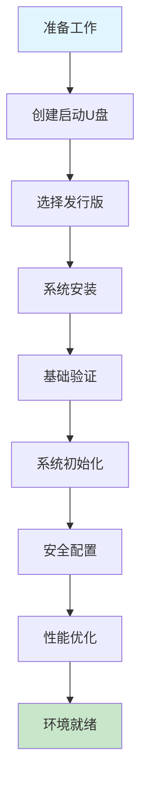

# 01-基础环境

## 概述

基础环境是系统运维的第一步，包含从系统安装到初始化配置的完整流程。本章节将指导您完成Linux系统的部署和基础配置，为后续的服务部署和运维工作奠定坚实基础。

---

## 📚 章节目录

### 🔧 系统安装准备
- **[创建启动U盘](创建启动U盘.md)**
  - 使用 Rufus 制作启动盘
  - 支持 CentOS、Ubuntu、Debian
  - 详细的配置步骤和注意事项

### 💿 系统安装指南  
- **[系统安装](系统安装.md)**
  - **CentOS** 系统完整安装流程
  - **Ubuntu** 系统详细安装步骤
  - **Debian** 系统安装配置指南
  - 磁盘分区、网络配置、用户管理
  - 安装后的基础验证

### ⚙️ 系统初始化
- **[系统初始化](系统初始化.md)**
  - NTP 时间同步配置
  - 网络静态 IP 设置
  - 内核升级与优化
  - 安全配置（防火墙、SSH）
  - 性能优化调优
  - 磁盘管理（LVM、GPT）
  - Vim 编辑器配置

---

## 🎯 学习路径

---

## 💡 快速开始

### 新手推荐流程

1. **准备阶段**
   - 下载对应的 ISO 镜像文件
   - 准备 8GB+ U盘
   - 备份重要数据

2. **安装阶段**  
   - 按照 [创建启动U盘](创建启动U盘.md) 制作启动盘
   - 根据需求选择发行版进行安装
   - 完成基础的网络和用户配置

3. **初始化阶段**
   - 执行 [系统初始化](系统初始化.md) 中的配置
   - 根据环境需求调整安全和性能参数
   - 验证系统功能正常

---

## 🔍 发行版选择指南

| 发行版 | 适用场景 | 特点 | 推荐用户 |
|--------|---------|------|----------|
| **CentOS/RHEL** | 企业服务器 | 稳定性好，企业级支持 | 系统管理员、企业用户 |
| **Ubuntu** | 开发环境、桌面 | 对新手友好，社区活跃 | 开发人员、新手用户 |
| **Debian** | 生产服务器 | 极高稳定性，安全性好 | 运维工程师、服务器环境 |

---

## ⚠️ 重要提醒

### 生产环境注意事项

- **备份数据**：安装前务必备份重要数据
- **网络规划**：提前规划 IP 地址分配方案
- **安全策略**：制定密码策略和访问控制规则
- **测试验证**：在测试环境验证后再部署生产环境

### 常见问题

- 安装过程网络连接失败 → 使用有线网络连接
- 分区选择困惑 → 推荐使用 LVM 方式便于扩容
- 忘记 root 密码 → 通过单用户模式重置
- 虚拟机安装 → 推荐 VMware 或 VirtualBox

---

## 📖 相关资源

### 官方文档
- [CentOS 官方文档](https://docs.centos.org/)
- [Ubuntu 官方文档](https://ubuntu.com/server/docs)
- [Debian 管理员手册](https://debian-handbook.info/)

### 镜像下载
- [阿里云 CentOS 镜像](https://mirrors.aliyun.com/centos/)
- [阿里云 Ubuntu 镜像](https://mirrors.aliyun.com/ubuntu-releases/)
- [清华大学开源软件镜像站](https://mirrors.tuna.tsinghua.edu.cn/)

---

