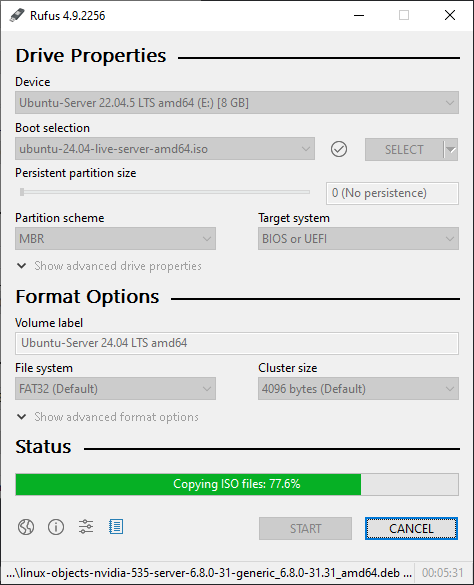

# 使用 Rufus 创建 Linux 启动 U 盘

[Rufus](https://rufus.ie/) 是一个免费、开源的工具，用于创建启动 U 盘，非常适合安装操作系统。

## 准备工作 

???+ Warning 

    - 在使用 U 盘之前，确保备份 U 盘上的所有重要数据。

在开始之前，请确保你已经准备好以下几样东西：

- **一个 4 GB 或更大容量的 U 盘**：请注意，所有现有数据都将被清除。
- **Linux ISO 文件**：从 Linux 发行版的官网下载你需要安装的 ISO 文件。
- **下载 Rufus**：访问 [Rufus 官网](https://rufus.ie/) 下载最新版本的 Rufus。

## 安装 Rufus

1. 插入 U 盘。
2. 运行你下载的 Rufus.exe 文件。
3. 如果系统请求权限，请确认。

## 配置 Rufus

在 Rufus 的界面中，进行以下配置：

1. **设备**：确保你的 U 盘在「设备」下被正确选择。
2. **启动选择**：点击「选择」按钮，浏览并选择你的 Linux ISO 文件。
3. **分区方案**：选择适合你系统的分区方案。
   - **MBR**：用于旧系统或传统 BIOS。
   - **GPT**：用于较新系统或 UEFI 模式。
4. **目标系统**：根据你选择的分区方案，这里会自动填充「BIOS（或 UEFI-CSM）」或「UEFI（非 CSM）」。
5. **文件系统**：一般选择「FAT32」（尤其是对于 UEFI 启动），这是大多数 Linux 启动 U 盘推荐的格式。

## 启动创建过程

???+ Warning 

    - 确保在创建过程中不要移除 U 盘。
    - 如果你的电脑在启动时没有提示进入 BIOS/UEFI，你可能需要查找特定于你电脑型号的快捷键。

1. 确认所有设置正确无误后，点击「开始」按钮。
2. Rufus 将提示你所有数据将被清除。点击「确定」继续。
3. 等待 Rufus 完成启动 U 盘的创建。这可能需要几分钟时间。

## 使用启动 U 盘安装 Linux

1. 完成 U 盘创建后，安全移除 U 盘。
2. 将 U 盘插入你想要安装 Linux 的电脑或者硬件服务器。
3. 重启电脑或者服务器，并进入 BIOS/UEFI 设置。
4. 在 BIOS/UEFI 中设置从 U 盘启动。
5. 保存设置并退出 BIOS/UEFI。
6. 电脑将从 U 盘启动，并开始 Linux 安装过程。按照屏幕上的指示完成 Linux 的安装。
7. 安装完成后，移除 U 盘并重启电脑。