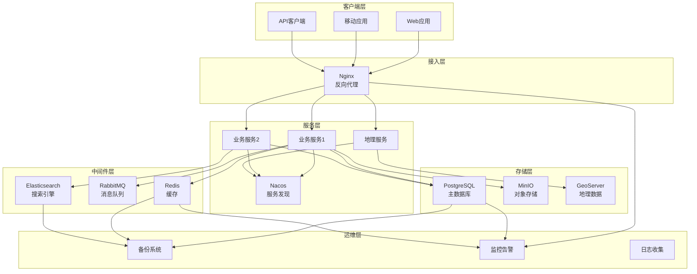
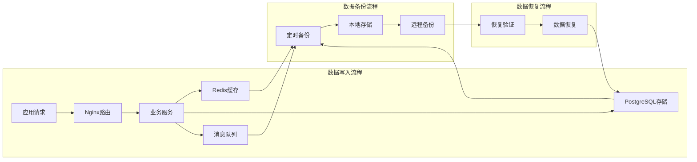

# 04-数据存储

## 📋 文档概览

### 🚀 核心内容

| 文档 | 描述 | 适用场景 |
|------|------|----------|
| [数据存储配置](数据存储.md) | 持久化存储、卷管理、性能优化 | 存储规划、性能调优 |
| [数据备份策略](数据备份.md) | 备份策略、恢复流程、监控告警 | 数据保护、灾难恢复 |

## 🛠 支持的服务组件

### 核心基础设施

- **Nginx** - 高性能 Web 服务器和反向代理
- **Nacos** - 服务发现和配置管理中心
- **MinIO** - S3 兼容的对象存储服务

### 数据存储层
- **PostgreSQL + PostGIS** - 关系型数据库和地理信息扩展
- **Redis** - 高性能内存数据存储
- **Elasticsearch** - 分布式搜索和分析引擎

### 消息与通信
- **RabbitMQ** - 企业级消息代理
- **GeoServer** - 地理空间数据服务器

## 🎯 快速开始

### 环境要求

```bash
# 系统要求
- Docker Engine 20.10+
- Docker Compose 2.0+
- 至少 8GB 内存
- 至少 50GB 可用磁盘空间

# 检查版本
docker --version
docker-compose --version
```

### 一键部署

```bash
# 1. 克隆或下载配置文件
mkdir middleware-stack && cd middleware-stack

# 2. 创建必要的目录结构
mkdir -p {data,conf,backups,scripts}
mkdir -p data/{nginx/{certs,html,logs},nacos/{data,logs},minio/data,redis/data,rabbitmq/data,postgres/{pgdata,backups},elastic/{data,logs,plugins},geoserver/data}

# 3. 设置权限
chmod -R 775 data/elastic/
sudo chown -R 1000:1000 data/elastic/ 2>/dev/null || true

# 4. 启动核心服务
docker-compose up -d nginx nacos minio redis postgres

# 5. 验证服务状态
docker-compose ps
```

### 服务访问

| 服务 | 访问地址 | 默认账号 | 默认密码 | 说明 |
|------|----------|----------|----------|------|
| Nginx | [http://localhost](http://localhost) | - | - | Web 服务器 |
| Nacos | [http://localhost:8848/nacos](http://localhost:8848/nacos) | nacos | nacos | 服务发现 |
| MinIO Console | [http://localhost:9001](http://localhost:9001) | admin | m3VeRe8a | 对象存储管理 |
| RabbitMQ | [http://localhost:15672](http://localhost:15672) | admin | feNop7N3 | 消息队列管理 |
| Elasticsearch | [http://localhost:9200](http://localhost:9200) | elastic | p0y4REbA | 搜索引擎 |
| GeoServer | [http://localhost:8080/geoserver](http://localhost:8080/geoserver) | admin | yoRiK02a | 地理信息服务 |

## 📚 详细指南
### [数据存储配置](数据存储.md)
数据持久化和存储管理的完整方案，包括：
- Docker 卷管理策略
- 目录结构规划
- 权限和安全设置
- 性能优化建议
- 存储容量规划

**适用场景**：
- 存储架构设计
- 性能调优
- 容量规划
- 数据迁移

### [数据备份策略](数据备份.md)
全方位的数据保护和恢复解决方案，包括：
- 分级备份策略
- 自动化备份脚本
- 灾难恢复流程
- 监控和告警
- 最佳实践

**适用场景**：
- 数据保护规划
- 灾难恢复准备
- 合规性要求
- 运维自动化

## 🔧 运维工具

### 监控脚本

```bash
# 服务健康检查
./scripts/health-check.sh

# 存储空间监控
./scripts/storage-monitor.sh

# 备份状态检查
./scripts/check-backup-status.sh
```

### 常用命令

```bash
# 查看所有服务状态
docker-compose ps

# 查看特定服务日志
docker-compose logs -f nacos

# 重启服务
docker-compose restart redis

# 扩展服务实例
docker-compose up -d --scale redis=2

# 清理资源
docker system prune -a
```

## 🏗 架构图

### 系统架构


### 数据流向


## 📖 最佳实践

### 部署建议
1. **资源规划**：根据业务规模合理分配 CPU、内存和存储资源
2. **网络隔离**：使用 Docker 网络分离不同服务组
3. **安全加固**：启用 HTTPS、配置防火墙、定期更新镜像
4. **监控告警**：部署监控系统，设置关键指标告警

### 运维规范
1. **配置管理**：使用版本控制管理配置文件
2. **日志管理**：集中收集和分析日志
3. **备份策略**：实施 3-2-1 备份原则
4. **变更管理**：建立标准化的变更流程

### 性能优化
1. **缓存策略**：合理使用 Redis 缓存热点数据
2. **数据库优化**：定期维护索引和统计信息
3. **网络优化**：使用 CDN 和负载均衡
4. **存储优化**：选择合适的存储类型和配置

## 🆘 故障排查

### 常见问题

**服务启动失败**
```bash
# 检查容器状态
docker-compose ps

# 查看错误日志
docker-compose logs service-name

# 检查端口占用
netstat -tulpn | grep :port
```

**数据无法持久化**
```bash
# 检查目录权限
ls -la data/

# 检查磁盘空间
df -h

# 检查挂载配置
docker inspect container-name
```

**性能问题**
```bash
# 查看资源使用
docker stats

# 查看系统负载
htop

# 查看网络连接
ss -tulpn
```

## 🤝 技术支持

### 文档更新
- 定期更新服务版本和配置
- 根据实际使用情况优化配置参数
- 收集用户反馈持续改进

### 社区支持
- GitHub Issues：技术问题讨论
- Wiki 文档：详细配置说明
- 最佳实践分享

---

**开始使用**：建议先阅读 [中间件数据库部署](03-应用服务/中间件数据库.md) 了解基础部署，然后根据需要参考存储和备份相关文档。

**获得帮助**：如有问题，请查看各文档的故障排查章节，或通过 GitHub Issues 寻求帮助。