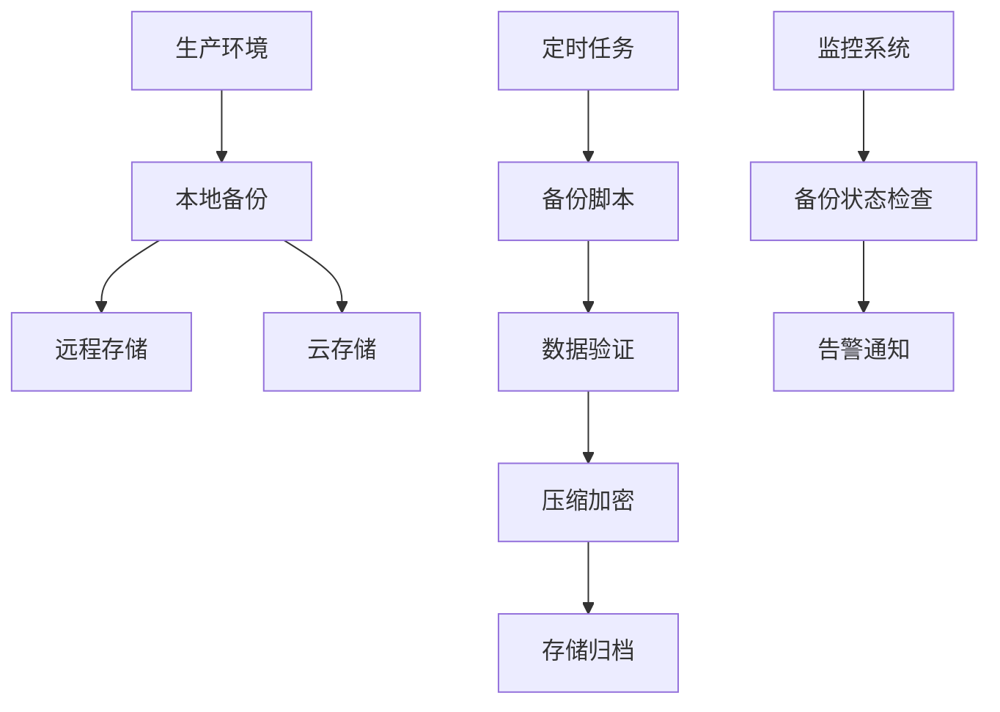

# 数据备份

本文档介绍各个中间件服务的数据备份策略，包括备份计划、备份方法、恢复流程和监控告警等内容。

## 备份策略概览

### 备份分类

**按数据重要性分类**:

- **关键数据**: PostgreSQL、Nacos配置、用户上传文件
- **重要数据**: Redis、RabbitMQ队列、Elasticsearch索引
- **一般数据**: 日志文件、临时缓存、系统配置

**按备份类型分类**:

- **完整备份**: 全量数据备份，恢复时间长但数据完整
- **增量备份**: 仅备份变更数据，节省空间但恢复复杂
- **差异备份**: 备份自上次完整备份后的所有变更

**按备份频率分类**:

- **实时备份**: 数据库WAL日志、Redis AOF
- **每日备份**: 关键业务数据、配置文件
- **每周备份**: 完整系统备份、历史数据归档
- **每月备份**: 长期存档、合规性备份

### 备份架构



## 各服务备份配置

### PostgreSQL 备份

**备份方式**:

1. **逻辑备份** - 使用 `pg_dump`
2. **物理备份** - 复制数据文件
3. **连续归档** - WAL 日志备份

**配置示例**:
```yaml
services:
  pg-backup:
    image: freelabspace/postgresql-backup:latest
    container_name: pg-backup
    environment:
      TZ: Asia/Shanghai
      PG_HOST: postgres
      PG_PORT: 5432
      PG_USER: postgres
      PG_PASSWORD: 5iQub9fo
      PG_DATABASE: gis
      BACKUP_RETENTION_DAYS: 7
      BACKUP_TIME: "03:00"
      BACKUP_INTERVAL: daily
      ENABLE_COMPRESSION: "true"
      BACKUP_FORMAT: "both"
    volumes:
      - ./data/postgres/backups:/backups
```

**手动备份命令**:
```bash
# 完整数据库备份
docker exec postgres pg_dump -U postgres -d gis -Fc > backup_$(date +%Y%m%d).dump

# 包含角色和表空间的完整备份
docker exec postgres pg_dumpall -U postgres > full_backup_$(date +%Y%m%d).sql

# 仅备份架构
docker exec postgres pg_dump -U postgres -d gis -s > schema_$(date +%Y%m%d).sql
```

### Redis 备份

**备份方式**:

1. **RDB快照** - 定期生成数据快照
2. **AOF日志** - 记录每个写操作
3. **混合持久化** - RDB + AOF

**自动备份配置**:
```conf
# redis.conf 配置
save 900 1      # 900秒内至少1个key变化
save 300 10     # 300秒内至少10个key变化  
save 60 10000   # 60秒内至少10000个key变化

# AOF配置
appendonly yes
appendfsync everysec
```

**手动备份**:
```bash
# 立即生成RDB快照
docker exec redis redis-cli BGSAVE

# 复制RDB文件
docker cp redis:/data/dump.rdb ./backups/redis/dump_$(date +%Y%m%d).rdb

# 复制AOF文件
docker cp redis:/data/appendonly.aof ./backups/redis/appendonly_$(date +%Y%m%d).aof
```

### Nacos 备份

**备份内容**:

- 配置数据 (`/home/nacos/data`)
- 服务注册信息
- 命名空间配置
- 用户权限配置

**备份方法**:
```bash
# 备份数据目录
tar -czf nacos_backup_$(date +%Y%m%d).tar.gz ./data/nacos/data/

# 通过API导出配置
curl -X GET "http://localhost:8848/nacos/v1/cs/configs?export=true&tenant=&group=" \
  -u nacos:nacos > nacos_config_$(date +%Y%m%d).zip
```

### MinIO 备份

**备份策略**:

1. **数据同步** - 使用 `mc mirror` 同步到另一个MinIO实例
2. **快照备份** - 定期打包数据目录
3. **版本控制** - 启用对象版本管理

**同步备份**:
```bash
# 配置MinIO客户端
docker exec minio-mc mc alias set source http://source-minio:9000 admin password
docker exec minio-mc mc alias set backup http://backup-minio:9000 admin password

# 同步数据
docker exec minio-mc mc mirror source/bucket backup/bucket --remove --overwrite
```

**快照备份**:
```bash
# 打包数据目录
tar -czf minio_backup_$(date +%Y%m%d).tar.gz ./data/minio/data/

# 使用rsync同步
rsync -avz --delete ./data/minio/data/ /backup/minio/
```

### Elasticsearch 备份

**备份方式**:

1. **快照备份** - 使用Snapshot API
2. **索引导出** - 使用elasticdump
3. **数据目录备份** - 直接备份数据文件

**快照备份配置**:
```bash
# 创建快照仓库
curl -X PUT "localhost:9200/_snapshot/backup_repo" \
  -u elastic:password \
  -H 'Content-Type: application/json' \
  -d '{
    "type": "fs",
    "settings": {
      "location": "/usr/share/elasticsearch/backups",
      "compress": true
    }
  }'

# 创建快照
curl -X PUT "localhost:9200/_snapshot/backup_repo/snapshot_$(date +%Y%m%d)" \
  -u elastic:password \
  -H 'Content-Type: application/json' \
  -d '{
    "indices": "*",
    "ignore_unavailable": true,
    "include_global_state": false
  }'
```

### RabbitMQ 备份

**备份内容**:

- 队列定义和消息
- 交换器配置
- 绑定关系
- 用户权限
- 虚拟主机

**导出定义**:
```bash
# 导出所有配置
docker exec rabbitmq rabbitmqctl export_definitions /tmp/definitions.json
docker cp rabbitmq:/tmp/definitions.json ./backups/rabbitmq/

# 备份持久化消息
docker cp rabbitmq:/var/lib/rabbitmq/ ./backups/rabbitmq/data_$(date +%Y%m%d)/
```

### GeoServer 备份

**备份内容**:

- 工作空间配置
- 数据存储配置
- 图层和样式定义
- 安全配置

**备份方法**:
```bash
# 备份数据目录
tar -czf geoserver_backup_$(date +%Y%m%d).tar.gz ./data/geoserver/data/

# 通过REST API导出工作空间
curl -u admin:password -X GET \
  "http://localhost:8080/geoserver/rest/workspaces.xml" > workspaces.xml
```

## 自动化备份脚本

### 综合备份脚本

```bash
#!/bin/bash
# comprehensive-backup.sh - 综合备份脚本

set -e
BACKUP_ROOT="./backups"
DATE=$(date +%Y%m%d_%H%M%S)
RETENTION_DAYS=7
LOG_FILE="$BACKUP_ROOT/backup_$DATE.log"

# 创建备份目录
mkdir -p $BACKUP_ROOT/{postgres,redis,elasticsearch,minio,nacos,rabbitmq,geoserver}

# 日志函数
log() {
    echo "[$(date '+%Y-%m-%d %H:%M:%S')] $1" | tee -a $LOG_FILE
}

# 检查服务状态
check_service() {
    local service=$1
    if ! docker ps | grep -q "$service"; then
        log "WARNING: Service $service is not running, skipping backup"
        return 1
    fi
    return 0
}

# PostgreSQL备份
backup_postgres() {
    if check_service "postgres"; then
        log "开始备份 PostgreSQL..."
        docker exec postgres pg_dump -U postgres -d gis -Fc | \
            gzip > "$BACKUP_ROOT/postgres/pg_backup_$DATE.dump.gz"
        log "PostgreSQL 备份完成"
    fi
}

# Redis备份
backup_redis() {
    if check_service "redis"; then
        log "开始备份 Redis..."
        docker exec redis redis-cli BGSAVE
        sleep 5
        docker cp redis:/data/dump.rdb "$BACKUP_ROOT/redis/dump_$DATE.rdb"
        log "Redis 备份完成"
    fi
}

# 执行所有备份
log "开始执行备份任务..."
backup_postgres
backup_redis
# 可以继续添加其他服务的备份函数

# 清理旧备份
find $BACKUP_ROOT -type f -mtime +$RETENTION_DAYS -delete
log "备份任务完成，旧备份已清理"
```

### 定时任务配置

**Crontab 配置**:
```bash
# 添加到crontab
crontab -e

# 每日凌晨3点执行备份
0 3 * * * /path/to/comprehensive-backup.sh

# 每周日执行完整备份
0 2 * * 0 /path/to/full-backup.sh

# 每小时备份关键数据
0 * * * * /path/to/critical-backup.sh
```

**Systemd Timer 配置**:
```ini
# /etc/systemd/system/backup.timer
[Unit]
Description=Daily Backup Timer
Requires=backup.service

[Timer]
OnCalendar=daily
Persistent=true

[Install]
WantedBy=timers.target
```

## 数据恢复流程

### PostgreSQL 恢复

**从dump文件恢复**:
```bash
# 停止应用服务
docker-compose stop app

# 删除现有数据库
docker exec postgres dropdb -U postgres gis

# 创建新数据库
docker exec postgres createdb -U postgres gis

# 恢复数据
gunzip -c pg_backup_20231201.dump.gz | docker exec -i postgres pg_restore -U postgres -d gis

# 重启服务
docker-compose start
```

### Redis 恢复

**从RDB文件恢复**:
```bash
# 停止Redis服务
docker-compose stop redis

# 替换RDB文件
cp dump_20231201.rdb ./data/redis/data/dump.rdb

# 重启服务
docker-compose start redis
```

### Elasticsearch 恢复

**从快照恢复**:
```bash
# 关闭索引
curl -X POST "localhost:9200/my_index/_close" -u elastic:password

# 恢复快照
curl -X POST "localhost:9200/_snapshot/backup_repo/snapshot_20231201/_restore" \
  -u elastic:password \
  -H 'Content-Type: application/json' \
  -d '{
    "indices": "my_index",
    "ignore_unavailable": true
  }'
```

## 备份监控与告警

### 备份状态检查

```bash
#!/bin/bash
# check-backup-status.sh

BACKUP_ROOT="./backups"
ALERT_EMAIL="admin@example.com"

check_backup_age() {
    local service=$1
    local max_age_hours=$2
    
    latest_backup=$(find $BACKUP_ROOT/$service -type f -name "*.gz" -o -name "*.dump" | head -1)
    
    if [ -z "$latest_backup" ]; then
        echo "ERROR: No backup found for $service"
        return 1
    fi
    
    backup_age=$(( ($(date +%s) - $(stat -c %Y "$latest_backup")) / 3600 ))
    
    if [ $backup_age -gt $max_age_hours ]; then
        echo "WARNING: $service backup is $backup_age hours old"
        return 1
    fi
    
    echo "OK: $service backup is current ($backup_age hours old)"
    return 0
}

# 检查各服务备份状态
check_backup_age "postgres" 25
check_backup_age "redis" 25
check_backup_age "elasticsearch" 25
```

### 告警配置

**邮件告警**:
```bash
# 在备份脚本中添加告警
if [ $? -ne 0 ]; then
    echo "Backup failed for $service" | \
    mail -s "Backup Alert - $service" $ALERT_EMAIL
fi
```

**Webhook 告警**:
```bash
# 发送到企业微信/钉钉
send_alert() {
    local message=$1
    curl -X POST "$WEBHOOK_URL" \
      -H 'Content-Type: application/json' \
      -d "{\"text\":\"$message\"}"
}
```

## 最佳实践

### 备份策略建议

1. **3-2-1 备份原则**:

   - 保留3份数据副本
   - 存储在2种不同介质上
   - 至少1份存储在异地

2. **分级备份策略**:

   - 关键数据：每4小时备份，保留30天
   - 重要数据：每天备份，保留7天
   - 一般数据：每周备份，保留30天

3. **备份验证**:

   - 定期测试恢复流程
   - 验证备份文件完整性
   - 监控备份成功率

### 性能优化

1. **备份时间安排**:

   - 避开业务高峰期
   - 错峰执行不同服务备份
   - 考虑备份对系统性能的影响

2. **网络优化**:

   - 使用压缩减少传输量
   - 增量备份减少数据量
   - 本地缓存远程备份

3. **存储优化**:

   - 使用重复数据删除
   - 分层存储策略
   - 自动清理过期备份

### 安全考虑

1. **数据加密**:

   - 备份文件加密存储
   - 传输过程加密
   - 密钥管理策略

2. **访问控制**:

   - 限制备份文件访问权限
   - 审计备份操作日志
   - 多重身份验证

3. **合规要求**:

   - 数据保留政策
   - 审计跟踪
   - 灾难恢复计划

通过完善的备份策略和自动化工具，可以确保关键业务数据的安全性和可恢复性。