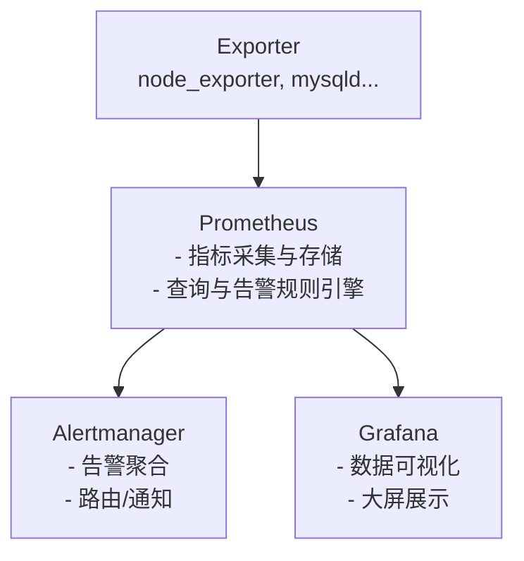

# Prometheus + Alertmanager + Grafana

在现代运维体系中，**Prometheus + Alertmanager + Grafana** 已经成为事实上的标准组合，分别承担 **监控采集、告警处理、可视化展示** 的角色。

---

## 架构概览



---

## 组件说明

### Prometheus

* **作用**：核心监控系统，负责从各类 Exporter 拉取指标，并保存到时序数据库。
* **特点**：

  * 支持灵活的 PromQL 查询语言。
  * 内置告警规则引擎。
  * 拉模式采集，避免过载。

### Alertmanager

* **作用**：专门处理 Prometheus 告警。
* **能力**：

  * 告警分组与聚合，避免“告警风暴”。
  * 支持静默（维护期不触发告警）。
  * 支持多种通知渠道：邮件、企业微信、钉钉、Slack 等。

### Grafana

* **作用**：数据可视化平台，用于绘制监控大盘。
* **特点**：

  * 丰富的图表组件。
  * 支持多数据源（Prometheus、Elasticsearch、MySQL 等）。
  * 可配置告警（Grafana 8+ 内置告警功能）。

---

## 示例配置

### Prometheus 配置

`prometheus.yml`

```yaml
global:
  scrape_interval: 15s  # 每 15 秒采集一次

scrape_configs:
  - job_name: 'node'
    static_configs:
      - targets: ['192.168.1.10:9100', '192.168.1.11:9100']
```

### 告警规则

`rules.yml`

```yaml
groups:
- name: basic-alerts
  rules:
  - alert: InstanceDown
    expr: up == 0
    for: 1m
    labels:
      severity: critical
    annotations:
      summary: "实例 {{ $labels.instance }} 已宕机"
      description: "目标在 1 分钟内无响应"
```

Prometheus 引入规则：

```yaml
rule_files:
  - "rules.yml"
```

### Alertmanager 配置

`alertmanager.yml`

```yaml
route:
  receiver: 'wechat'

receivers:
- name: 'wechat'
  wechat_configs:
  - api_secret: 'xxxx'
    corp_id: 'wwxxxx'
    to_party: 'ops'
    agent_id: '1000003'
```

### Grafana 可视化

* 添加 Prometheus 作为数据源。
* 创建大盘（Dashboard），导入官方模板（如 Node Exporter Full）。
* 设置展示指标：CPU 使用率、内存、磁盘 IO、网络吞吐等。

