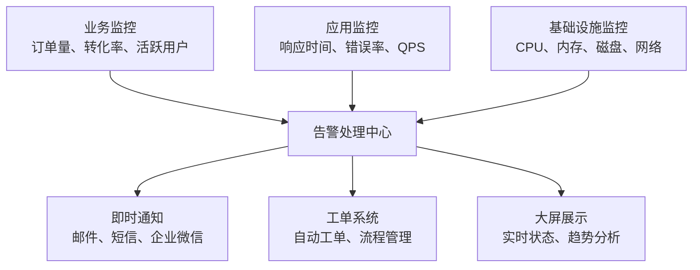

# 监控告警系统设计与实战应用

在现代运维体系中，监控告警是保障系统稳定运行的重要环节。本文将结合理论基础和docker-compose实际部署，为你构建一套完整的监控告警知识体系。

---

## 1. 监控告警核心理论

### 1.1 四个黄金信号

Google SRE 提出的四个黄金信号是监控告警的核心指标：

1. **延迟（Latency）**：服务处理请求所需的时间
2. **流量（Traffic）**：系统承载的请求量  
3. **错误（Errors）**：失败请求的比率
4. **饱和度（Saturation）**：系统资源的使用程度

### 1.2 分层监控架构



### 1.3 告警级别定义

| 级别 | 描述 | 响应时间 | 通知方式 | 实际示例 |
|------|------|----------|----------|----------|
| P0 - 紧急 | 业务完全中断 | 立即响应 | 电话+短信+微信 | 支付系统宕机 |
| P1 - 严重 | 核心功能异常 | 15分钟内 | 短信+微信+邮件 | 数据库主从切换 |
| P2 - 重要 | 性能显著下降 | 30分钟内 | 微信+邮件 | API响应时间超阈值 |
| P3 - 一般 | 次要功能异常 | 1小时内 | 邮件 | 非关键服务告警 |

---

## 2. Docker Compose 部署方案

### 2.1 项目结构

```
monitoring/
├── docker-compose.yml
├── prometheus/
│   ├── prometheus.yml
│   └── rules/
│       ├── system_alerts.yml
│       ├── app_alerts.yml
│       └── business_alerts.yml
├── alertmanager/
│   ├── alertmanager.yml
│   └── templates/
│       └── wechat.tmpl
├── grafana/
│   ├── datasources/
│   └── dashboards/
└── scripts/
    ├── deploy.sh
    └── node_exporter_install.sh
```

### 2.2 主配置文件

**docker-compose.yml**
```yaml
version: '3.8'

services:
  prometheus:
    image: prom/prometheus:v2.47.0
    container_name: prometheus
    ports:
      - "9090:9090"
    volumes:
      - ./prometheus/prometheus.yml:/etc/prometheus/prometheus.yml
      - ./prometheus/rules:/etc/prometheus/rules
      - prometheus_data:/prometheus
    command:
      - '--config.file=/etc/prometheus/prometheus.yml'
      - '--storage.tsdb.path=/prometheus'
      - '--storage.tsdb.retention.time=30d'
      - '--storage.tsdb.retention.size=50GB'
      - '--web.console.templates=/etc/prometheus/consoles'
      - '--web.console.libraries=/etc/prometheus/console_libraries'
      - '--web.enable-lifecycle'
      - '--web.enable-admin-api'
    networks:
      - monitoring
    restart: unless-stopped

  alertmanager:
    image: prom/alertmanager:v0.26.0
    container_name: alertmanager
    ports:
      - "9093:9093"
    volumes:
      - ./alertmanager/alertmanager.yml:/etc/alertmanager/alertmanager.yml
      - ./alertmanager/templates:/etc/alertmanager/templates
      - alertmanager_data:/alertmanager
    command:
      - '--config.file=/etc/alertmanager/alertmanager.yml'
      - '--storage.path=/alertmanager'
      - '--web.external-url=http://localhost:9093'
    networks:
      - monitoring
    restart: unless-stopped

  grafana:
    image: grafana/grafana:10.1.0
    container_name: grafana
    ports:
      - "3000:3000"
    volumes:
      - grafana_data:/var/lib/grafana
      - ./grafana/datasources:/etc/grafana/provisioning/datasources
      - ./grafana/dashboards:/etc/grafana/provisioning/dashboards
    environment:
      - GF_SECURITY_ADMIN_USER=admin
      - GF_SECURITY_ADMIN_PASSWORD=admin123
      - GF_USERS_ALLOW_SIGN_UP=false
      - GF_INSTALL_PLUGINS=grafana-piechart-panel
    networks:
      - monitoring
    restart: unless-stopped

  # Node Exporter 用于监控宿主机
  node-exporter:
    image: prom/node-exporter:v1.6.1
    container_name: node-exporter
    ports:
      - "9100:9100"
    volumes:
      - /proc:/host/proc:ro
      - /sys:/host/sys:ro
      - /:/rootfs:ro
    command:
      - '--path.procfs=/host/proc'
      - '--path.rootfs=/rootfs'
      - '--path.sysfs=/host/sys'
      - '--collector.filesystem.mount-points-exclude=^/(sys|proc|dev|host|etc)($$|/)'
    networks:
      - monitoring
    restart: unless-stopped

  # cAdvisor 用于监控容器
  cadvisor:
    image: gcr.io/cadvisor/cadvisor:v0.47.0
    container_name: cadvisor
    ports:
      - "8080:8080"
    volumes:
      - /:/rootfs:ro
      - /var/run:/var/run:ro
      - /sys:/sys:ro
      - /var/lib/docker/:/var/lib/docker:ro
      - /dev/disk/:/dev/disk:ro
    privileged: true
    devices:
      - /dev/kmsg
    networks:
      - monitoring
    restart: unless-stopped

networks:
  monitoring:
    driver: bridge

volumes:
  prometheus_data:
  alertmanager_data:
  grafana_data:
```

### 2.3 Prometheus 配置

**prometheus/prometheus.yml**
```yaml
global:
  scrape_interval: 15s
  evaluation_interval: 15s
  external_labels:
    cluster: 'docker-monitoring'
    replica: 'A'

rule_files:
  - "/etc/prometheus/rules/*.yml"

alerting:
  alertmanagers:
    - static_configs:
        - targets:
          - alertmanager:9093

scrape_configs:
  # Prometheus 自监控
  - job_name: 'prometheus'
    static_configs:
      - targets: ['localhost:9090']

  # Node Exporter 系统监控
  - job_name: 'node-exporter'
    static_configs:
      - targets: ['node-exporter:9100']
    relabel_configs:
      - source_labels: [__address__]
        target_label: instance
        replacement: 'monitoring-server'

  # cAdvisor 容器监控
  - job_name: 'cadvisor'
    static_configs:
      - targets: ['cadvisor:8080']

  # 外部服务器监控
  - job_name: 'external-servers'
    static_configs:
      - targets:
        - '192.168.1.10:9100'  # app-server-01
        - '192.168.1.11:9100'  # app-server-02
    relabel_configs:
      - source_labels: [__address__]
        regex: '192.168.1.10:9100'
        target_label: server_role
        replacement: 'app-server-01'
      - source_labels: [__address__]
        regex: '192.168.1.11:9100'
        target_label: server_role
        replacement: 'app-server-02'

  # Spring Boot 应用监控
  - job_name: 'spring-boot-apps'
    metrics_path: '/actuator/prometheus'
    static_configs:
      - targets:
        - '192.168.1.10:8080'  # app-01
        - '192.168.1.11:8080'  # app-02
    scrape_interval: 10s

  # MySQL 数据库监控
  - job_name: 'mysql'
    static_configs:
      - targets: ['192.168.1.10:9104']
    relabel_configs:
      - source_labels: [__address__]
        target_label: mysql_instance
        replacement: 'prod-mysql-01'

  # Redis 缓存监控
  - job_name: 'redis'
    static_configs:
      - targets: ['192.168.1.10:9121']
```

### 2.4 系统告警规则

**prometheus/rules/system_alerts.yml**
```yaml
groups:
- name: system_alerts
  rules:
  # 实例宕机告警
  - alert: InstanceDown
    expr: up == 0
    for: 1m
    labels:
      severity: critical
      team: ops
      service: infrastructure
    annotations:
      summary: "实例 {{ $labels.instance }} 宕机"
      description: "{{ $labels.job }}/{{ $labels.instance }} 已宕机超过1分钟"
      runbook_url: "https://wiki.company.com/runbook/instance-down"

  # CPU使用率告警
  - alert: HighCPUUsage
    expr: (100 - (avg by(instance)(irate(node_cpu_seconds_total{mode="idle"}[5m])) * 100)) > 85
    for: 5m
    labels:
      severity: warning
      team: ops
      service: infrastructure
    annotations:
      summary: "CPU使用率过高"
      description: "实例 {{ $labels.instance }} CPU使用率 {{ $value | printf \"%.1f\" }}%，超过85%阈值，持续5分钟"

  - alert: CriticalCPUUsage
    expr: (100 - (avg by(instance)(irate(node_cpu_seconds_total{mode="idle"}[5m])) * 100)) > 95
    for: 2m
    labels:
      severity: critical
      team: ops
      service: infrastructure
    annotations:
      summary: "CPU使用率极高"
      description: "实例 {{ $labels.instance }} CPU使用率 {{ $value | printf \"%.1f\" }}%，超过95%阈值"

  # 内存使用率告警
  - alert: HighMemoryUsage
    expr: (1 - (node_memory_MemAvailable_bytes / node_memory_MemTotal_bytes)) * 100 > 80
    for: 5m
    labels:
      severity: warning
      team: ops
      service: infrastructure
    annotations:
      summary: "内存使用率过高"
      description: "实例 {{ $labels.instance }} 内存使用率 {{ $value | printf \"%.1f\" }}%，超过80%阈值"

  # 磁盘空间告警
  - alert: DiskSpaceWarning
    expr: (1 - node_filesystem_avail_bytes{fstype!="tmpfs",mountpoint!="/boot"} / node_filesystem_size_bytes{fstype!="tmpfs",mountpoint!="/boot"}) * 100 > 80
    for: 5m
    labels:
      severity: warning
      team: ops
      service: infrastructure
    annotations:
      summary: "磁盘空间不足"
      description: "实例 {{ $labels.instance }} 磁盘 {{ $labels.mountpoint }} 使用率 {{ $value | printf \"%.1f\" }}%"

  - alert: DiskSpaceCritical
    expr: (1 - node_filesystem_avail_bytes{fstype!="tmpfs",mountpoint!="/boot"} / node_filesystem_size_bytes{fstype!="tmpfs",mountpoint!="/boot"}) * 100 > 90
    for: 2m
    labels:
      severity: critical
      team: ops
      service: infrastructure
    annotations:
      summary: "磁盘空间严重不足"
      description: "实例 {{ $labels.instance }} 磁盘 {{ $labels.mountpoint }} 使用率 {{ $value | printf \"%.1f\" }}%，请立即处理"

  # 系统负载告警
  - alert: HighSystemLoad
    expr: node_load5 > (count by(instance)(node_cpu_seconds_total{mode="idle"}) * 1.5)
    for: 10m
    labels:
      severity: warning
      team: ops
      service: infrastructure
    annotations:
      summary: "系统负载过高"
      description: "实例 {{ $labels.instance }} 5分钟负载 {{ $value | printf \"%.2f\" }}，超过CPU核数的1.5倍"

  # Docker容器告警
  - alert: ContainerDown
    expr: absent(container_last_seen) or (time() - container_last_seen > 60)
    for: 1m
    labels:
      severity: critical
      team: ops
      service: container
    annotations:
      summary: "容器 {{ $labels.name }} 已停止"
      description: "容器 {{ $labels.name }} 在实例 {{ $labels.instance }} 上已停止运行"

  - alert: ContainerHighMemoryUsage
    expr: (container_memory_usage_bytes / container_spec_memory_limit_bytes) * 100 > 80
    for: 5m
    labels:
      severity: warning
      team: ops
      service: container
    annotations:
      summary: "容器内存使用率过高"
      description: "容器 {{ $labels.name }} 内存使用率 {{ $value | printf \"%.1f\" }}%"
```

### 2.5 应用告警规则

**prometheus/rules/app_alerts.yml**
```yaml
groups:
- name: application_alerts
  rules:
  # HTTP错误率告警
  - alert: HighHTTPErrorRate
    expr: (sum(rate(http_requests_total{status=~"5.."}[5m])) by (instance, job) / sum(rate(http_requests_total[5m])) by (instance, job)) * 100 > 5
    for: 2m
    labels:
      severity: critical
      team: dev
      service: application
    annotations:
      summary: "HTTP错误率过高"
      description: "应用 {{ $labels.job }} 实例 {{ $labels.instance }} 5xx错误率 {{ $value | printf \"%.2f\" }}%，超过5%阈值"

  # 响应时间告警
  - alert: HighResponseTime
    expr: histogram_quantile(0.95, sum(rate(http_request_duration_seconds_bucket[5m])) by (le, instance, job)) > 1
    for: 5m
    labels:
      severity: warning
      team: dev
      service: application
    annotations:
      summary: "响应时间过高"
      description: "应用 {{ $labels.job }} 实例 {{ $labels.instance }} P95响应时间 {{ $value | printf \"%.2f\" }}s，超过1s阈值"

  # JVM内存告警
  - alert: HighJVMMemoryUsage
    expr: (jvm_memory_used_bytes{area="heap"} / jvm_memory_max_bytes{area="heap"}) * 100 > 80
    for: 5m
    labels:
      severity: warning
      team: dev
      service: application
    annotations:
      summary: "JVM堆内存使用率过高"
      description: "应用 {{ $labels.job }} JVM堆内存使用率 {{ $value | printf \"%.1f\" }}%，超过80%阈值"

  # GC时间告警
  - alert: HighGCTime
    expr: increase(jvm_gc_collection_seconds_sum[5m]) / increase(jvm_gc_collection_seconds_count[5m]) > 0.1
    for: 5m
    labels:
      severity: warning
      team: dev
      service: application
    annotations:
      summary: "GC耗时过长"
      description: "应用 {{ $labels.job }} 平均GC时间 {{ $value | printf \"%.3f\" }}s，超过0.1s阈值"

  # 线程死锁告警
  - alert: JVMDeadlockedThreads
    expr: jvm_threads_deadlocked > 0
    for: 1m
    labels:
      severity: critical
      team: dev
      service: application
    annotations:
      summary: "JVM检测到死锁线程"
      description: "应用 {{ $labels.job }} 检测到 {{ $value }} 个死锁线程"
```

### 2.6 业务告警规则

**prometheus/rules/business_alerts.yml**
```yaml
groups:
- name: business_alerts
  rules:
  # 订单量异常告警
  - alert: LowOrderCount
    expr: rate(orders_created_total[10m]) * 3600 < 100  # 每小时订单数少于100
    for: 10m
    labels:
      severity: warning
      team: business
      service: order
    annotations:
      summary: "订单量异常偏低"
      description: "当前订单创建速率 {{ $value | printf \"%.0f\" }} 订单/小时，低于正常水平100"

  # 支付成功率告警
  - alert: LowPaymentSuccessRate
    expr: (rate(payment_total{status="success"}[5m]) / rate(payment_total[5m])) * 100 < 95
    for: 5m
    labels:
      severity: critical
      team: business
      service: payment
    annotations:
      summary: "支付成功率过低"
      description: "支付成功率 {{ $value | printf \"%.1f\" }}%，低于95%阈值"

  # 用户登录异常
  - alert: HighLoginFailureRate
    expr: (rate(login_attempts_total{status="failed"}[5m]) / rate(login_attempts_total[5m])) * 100 > 20
    for: 3m
    labels:
      severity: warning
      team: security
      service: auth
    annotations:
      summary: "登录失败率异常"
      description: "登录失败率 {{ $value | printf \"%.1f\" }}%，超过20%阈值，可能存在安全问题"

  # API调用量异常
  - alert: APICallAbnormal
    expr: rate(api_requests_total[5m]) < 10
    for: 10m
    labels:
      severity: warning
      team: dev
      service: api
    annotations:
      summary: "API调用量异常偏低"
      description: "API调用速率 {{ $value | printf \"%.1f\" }} 请求/秒，异常偏低"
```

### 2.7 Alertmanager 配置

**alertmanager/alertmanager.yml**
```yaml
global:
  smtp_smarthost: 'smtp.163.com:587'
  smtp_from: 'alert@company.com'
  smtp_auth_username: 'alert@company.com'
  smtp_auth_password: 'your_smtp_password'
  wechat_api_url: 'https://qyapi.weixin.qq.com/cgi-bin/'

templates:
  - '/etc/alertmanager/templates/*.tmpl'

route:
  group_by: ['alertname', 'cluster', 'service']
  group_wait: 10s
  group_interval: 10s
  repeat_interval: 1h
  receiver: 'default'
  routes:
  # 关键业务告警 - 立即通知
  - match:
      severity: critical
    receiver: 'critical-alerts'
    group_wait: 0s
    repeat_interval: 5m
    routes:
    # 支付系统特殊处理
    - match:
        service: payment
      receiver: 'payment-team'
    # 基础设施故障
    - match:
        service: infrastructure
      receiver: 'ops-critical'

  # 一般告警
  - match:
      severity: warning
    receiver: 'warning-alerts'

  # 业务告警
  - match:
      team: business
    receiver: 'business-team'

  # 测试环境静默
  - match:
      cluster: test
    receiver: 'null'

receivers:
# 默认接收者
- name: 'default'
  email_configs:
  - to: 'ops@company.com'
    subject: '【监控告警】{{ .GroupLabels.alertname }}'
    body: |
      {{ range .Alerts }}
      告警名称: {{ .Annotations.summary }}
      告警描述: {{ .Annotations.description }}
      告警级别: {{ .Labels.severity }}
      触发时间: {{ .StartsAt.Format "2006-01-02 15:04:05" }}
      实例信息: {{ .Labels.instance }}
      {{ end }}

# 关键告警
- name: 'critical-alerts'
  email_configs:
  - to: 'ops-leader@company.com,cto@company.com'
    subject: '【🚨紧急告警】{{ .GroupLabels.alertname }}'
  wechat_configs:
  - corp_id: 'your_corp_id'
    api_secret: 'your_api_secret'
    to_party: 'ops'
    agent_id: '1000003'
    title: '🚨 紧急告警'
    message: |
      {{ template "wechat.default.message" . }}

# 运维关键告警
- name: 'ops-critical'
  email_configs:
  - to: 'ops-leader@company.com'
  webhook_configs:
  - url: 'http://your-webhook-server/dingtalk'
    title: '基础设施告警'
    text: |
      {{ range .Alerts }}
      {{ .Annotations.summary }}
      {{ .Annotations.description }}
      时间: {{ .StartsAt.Format "2006-01-02 15:04:05" }}
      {{ end }}

# 支付团队告警
- name: 'payment-team'
  email_configs:
  - to: 'payment-dev@company.com'
  webhook_configs:
  - url: 'http://your-webhook-server/payment-alerts'

# 一般告警
- name: 'warning-alerts'
  email_configs:
  - to: 'ops@company.com'
    subject: '【⚠️警告】{{ .GroupLabels.alertname }}'

# 业务告警
- name: 'business-team'
  email_configs:
  - to: 'business@company.com,product@company.com'
    subject: '【📊业务告警】{{ .GroupLabels.alertname }}'

# 空接收者
- name: 'null'

# 告警抑制规则
inhibit_rules:
# 当critical告警触发时，抑制相同实例的warning告警
- source_match:
    severity: 'critical'
  target_match:
    severity: 'warning'
  equal: ['alertname', 'instance']

# 当实例宕机时，抑制该实例的所有其他告警
- source_match:
    alertname: 'InstanceDown'
  target_match_re:
    alertname: '.*'
  equal: ['instance']
```

### 2.8 企业微信告警模板

**alertmanager/templates/wechat.tmpl**
```go-template
{{ define "wechat.default.message" }}
{{- if gt (len .Alerts.Firing) 0 -}}
🚨 **告警触发** ({{ len .Alerts.Firing }}条)
{{ range .Alerts.Firing }}
**{{ .Annotations.summary }}**
> 描述: {{ .Annotations.description }}
> 级别: {{ .Labels.severity }}
> 实例: {{ .Labels.instance }}
> 时间: {{ .StartsAt.Format "01-02 15:04:05" }}
{{ if .Annotations.runbook_url }}> [处理手册]({{ .Annotations.runbook_url }}){{ end }}

{{ end }}
{{- end }}

{{- if gt (len .Alerts.Resolved) 0 -}}
✅ **告警恢复** ({{ len .Alerts.Resolved }}条)
{{ range .Alerts.Resolved }}
**{{ .Annotations.summary }}**
> 实例: {{ .Labels.instance }}
> 持续时间: {{ (.EndsAt.Sub .StartsAt).Round 1 }}
> 恢复时间: {{ .EndsAt.Format "01-02 15:04:05" }}

{{ end }}
{{- end }}
{{ end }}
```

---

## 3. 一键部署脚本

### 3.1 完整部署脚本

**scripts/deploy.sh**
```bash
#!/bin/bash
# 监控系统一键部署脚本

set -e

SCRIPT_DIR="$(cd "$(dirname "${BASH_SOURCE[0]}")" && pwd)"
PROJECT_DIR="$(dirname "$SCRIPT_DIR")"

echo "🚀 开始部署监控告警系统..."

# 检查Docker和docker-compose
if ! command -v docker &> /dev/null; then
    echo "❌ Docker 未安装，请先安装Docker"
    exit 1
fi

if ! command -v docker-compose &> /dev/null; then
    echo "❌ docker-compose 未安装，请先安装docker-compose"
    exit 1
fi

# 创建必要目录
echo "📁 创建目录结构..."
mkdir -p "$PROJECT_DIR"/{prometheus/rules,alertmanager/templates,grafana/{datasources,dashboards}}

# 检查配置文件
echo "🔍 检查配置文件..."
required_files=(
    "docker-compose.yml"
    "prometheus/prometheus.yml"
    "prometheus/rules/system_alerts.yml"
    "prometheus/rules/app_alerts.yml"
    "prometheus/rules/business_alerts.yml"
    "alertmanager/alertmanager.yml"
    "alertmanager/templates/wechat.tmpl"
)

for file in "${required_files[@]}"; do
    if [[ ! -f "$PROJECT_DIR/$file" ]]; then
        echo "❌ 缺少配置文件: $file"
        exit 1
    fi
done

# 设置权限
echo "🔒 设置权限..."
sudo chown -R 472:472 "$PROJECT_DIR/grafana" 2>/dev/null || true
sudo chown -R 65534:65534 "$PROJECT_DIR/prometheus" 2>/dev/null || true
sudo chown -R 65534:65534 "$PROJECT_DIR/alertmanager" 2>/dev/null || true

cd "$PROJECT_DIR"

# 启动服务
echo "🔄 启动监控服务..."
docker-compose down 2>/dev/null || true
docker-compose up -d

# 等待服务启动
echo "⏳ 等待服务启动..."
sleep 30

# 检查服务状态
echo "🔍 检查服务状态..."
services=("prometheus" "alertmanager" "grafana" "node-exporter" "cadvisor")
all_healthy=true

for service in "${services[@]}"; do
    if docker-compose ps "$service" | grep -q "Up"; then
        echo "✅ $service: 运行正常"
    else
        echo "❌ $service: 启动失败"
        all_healthy=false
    fi
done

if $all_healthy; then
    echo ""
    echo "🎉 监控系统部署成功！"
    echo "📊 访问地址："
    echo "  - Prometheus: http://localhost:9090"
    echo "  - Alertmanager: http://localhost:9093" 
    echo "  - Grafana: http://localhost:3000 (admin/admin123)"
    echo ""
    echo "📝 下一步操作："
    echo "  1. 在目标服务器安装 Node Exporter"
    echo "  2. 配置应用程序指标暴露"
    echo "  3. 导入 Grafana 仪表盘"
    echo "  4. 测试告警通知"
else
    echo "❌ 部署失败，请检查日志: docker-compose logs"
    exit 1
fi
```

### 3.2 Node Exporter 安装脚本

**scripts/node_exporter_install.sh**
```bash
#!/bin/bash
# 在目标服务器上安装 Node Exporter

set -e

NODE_EXPORTER_VERSION="1.6.1"
INSTALL_DIR="/opt/node_exporter"
SERVICE_USER="node_exporter"

echo "🔧 安装 Node Exporter v$NODE_EXPORTER_VERSION"

# 检查是否为root用户
if [[ $EUID -ne 0 ]]; then
   echo "❌ 请使用root用户运行此脚本"
   exit 1
fi

# 创建用户
if ! id "$SERVICE_USER" &>/dev/null; then
    useradd -r -s /bin/false "$SERVICE_USER"
    echo "✅ 创建用户: $SERVICE_USER"
fi

# 下载并安装
echo "📥 下载 Node Exporter..."
cd /tmp
wget -q "https://github.com/prometheus/node_exporter/releases/download/v$NODE_EXPORTER_VERSION/node_exporter-$NODE_EXPORTER_VERSION.linux-amd64.tar.gz"

# 解压并安装
tar -xzf "node_exporter-$NODE_EXPORTER_VERSION.linux-amd64.tar.gz"
mkdir -p "$INSTALL_DIR"
cp "node_exporter-$NODE_EXPORTER_VERSION.linux-amd64/node_exporter" "$INSTALL_DIR/"
chmod +x "$INSTALL_DIR/node_exporter"
chown -R "$SERVICE_USER:$SERVICE_USER" "$INSTALL_DIR"

# 创建systemd服务
cat > /etc/systemd/system/node_exporter.service << EOF
[Unit]
Description=Node Exporter
Documentation=https://prometheus.io/docs/guides/node-exporter/
After=network-online.target

[Service]
Type=simple
User=$SERVICE_USER
ExecStart=$INSTALL_DIR/node_exporter \\
  --web.listen-address=:9100 \\
  --path.procfs=/proc \\
  --path.sysfs=/sys \\
  --collector.filesystem.ignored-mount-points='^/(dev|proc|sys|var/lib/docker/.+)(\$|/)' \\
  --collector.filesystem.ignored-fs-types='^(autofs|binfmt_misc|cgroup|configfs|debugfs|devpts|devtmpfs|fusectl|hugetlbfs|mqueue|overlay|proc|procfs|pstore|rpc_pipefs|securityfs|sysfs|tracefs)\ \\
  --collector.systemd \\
  --collector.processes

SyslogIdentifier=node_exporter
Restart=always
RestartSec=1

[Install]
WantedBy=multi-user.target
EOF

# 启动服务
systemctl daemon-reload
systemctl enable node_exporter
systemctl start node_exporter

# 验证安装
sleep 3
if systemctl is-active --quiet node_exporter; then
    echo "✅ Node Exporter 安装成功"
    echo "📊 监控端点: http://$(hostname -I | awk '{print $1}'):9100/metrics"
    
    # 简单测试
    if curl -s http://localhost:9100/metrics | grep -q "node_cpu_seconds_total"; then
        echo "✅ 指标采集正常"
    else
        echo "⚠️  指标采集可能有问题，请检查"
    fi
else
    echo "❌ Node Exporter 启动失败"
    systemctl status node_exporter
    exit 1
fi

# 清理临时文件
rm -rf /tmp/node_exporter-*
echo "🧹 清理完成"
```

---

## 4. Spring Boot 应用集成

### 4.1 添加监控依赖

**pom.xml**
```xml
<dependencies>
    <!-- Spring Boot Actuator -->
    <dependency>
        <groupId>org.springframework.boot</groupId>
        <artifactId>spring-boot-starter-actuator</artifactId>
    </dependency>
    
    <!-- Micrometer Prometheus -->
    <dependency>
        <groupId>io.micrometer</groupId>
        <artifactId>micrometer-registry-prometheus</artifactId>
    </dependency>
</dependencies>
```

### 4.2 应用配置

**application.yml**
```yaml
management:
  endpoints:
    web:
      exposure:
        include: health,info,metrics,prometheus
      base-path: /actuator
  endpoint:
    health:
      show-details: always
    prometheus:
      enabled: true
  metrics:
    export:
      prometheus:
        enabled: true
    distribution:
      percentiles-histogram:
        http.server.requests: true
      percentiles:
        http.server.requests: 0.5,0.9,0.95,0.99
    tags:
      application: ${spring.application.name}
      environment: ${spring.profiles.active:dev}

# 应用信息
info:
  app:
    name: ${spring.application.name}
    version: @project.version@
    description: Demo application for monitoring
```

### 4.3 自定义业务指标

**BusinessMetrics.java**
```java
package com.example.monitoring;

import io.micrometer.core.instrument.*;
import org.springframework.stereotype.Component;

import java.util.concurrent.atomic.AtomicInteger;

@Component
public class BusinessMetrics {
    
    private final Counter orderCreatedCounter;
    private final Counter paymentCounter;
    private final Timer orderProcessTimer;
    private final Gauge activeUsersGauge;
    private final DistributionSummary orderAmountSummary;
    private final AtomicInteger activeUsers = new AtomicInteger(0);
    
    public BusinessMetrics(MeterRegistry registry) {
        // 订单创建计数器
        this.orderCreatedCounter = Counter.builder("orders_created_total")
                .description("订单创建总数")
                .tag("type", "business")
                .register(registry);
        
        // 支付计数器（带状态标签）
        this.paymentCounter = Counter.builder("payment_total")
                .description("支付总数")
                .register(registry);
        
        // 订单处理时间
        this.orderProcessTimer = Timer.builder("order_process_duration_seconds")
                .description("订单处理耗时")
                .register(registry);
        
        // 活跃用户数
        this.activeUsersGauge = Gauge.builder("active_users_current")
                .description("当前活跃用户数")
                .register(registry, activeUsers, AtomicInteger::get);
        
        // 订单金额分布
        this.orderAmountSummary = DistributionSummary.builder("order_amount_yuan")
                .description("订单金额分布")
                .minimumExpectedValue(1.0)
                .maximumExpectedValue(10000.0)
                .publishPercentiles(0.5, 0.95, 0.99)
                .register(registry);
    }
    
    // 记录订单创建
    public void recordOrderCreated() {
        orderCreatedCounter.increment();
    }
    
    // 记录支付结果
    public void recordPayment(String status, double amount) {
        paymentCounter.increment(Tags.of("status", status));
        if ("success".equals(status)) {
            orderAmountSummary.record(amount);
        }
    }
    
    // 开始订单处理计时
    public Timer.Sample startOrderProcessing() {
        return Timer.start(orderProcessTimer);
    }
    
    // 更新活跃用户数
    public void setActiveUsers(int count) {
        activeUsers.set(count);
    }
}
```

### 4.4 业务接口示例

**OrderController.java**
```java
package com.example.controller;

import com.example.monitoring.BusinessMetrics;
import io.micrometer.core.instrument.Timer;
import org.springframework.beans.factory.annotation.Autowired;
import org.springframework.web.bind.annotation.*;

import java.util.Random;

@RestController
@RequestMapping("/api/orders")
public class OrderController {
    
    @Autowired
    private BusinessMetrics businessMetrics;
    
    private final Random random = new Random();
    
    @PostMapping
    public String createOrder(@RequestBody OrderRequest request) {
        // 开始计时
        Timer.Sample sample = businessMetrics.startOrderProcessing();
        
        try {
            // 模拟业务处理
            Thread.sleep(random.nextInt(1000) + 100);
            
            // 记录订单创建
            businessMetrics.recordOrderCreated();
            
            // 模拟支付处理
            boolean paymentSuccess = random.nextDouble() > 0.05; // 95% 成功率
            double amount = request.getAmount();
            
            if (paymentSuccess) {
                businessMetrics.recordPayment("success", amount);
                return "Order created successfully";
            } else {
                businessMetrics.recordPayment("failed", amount);
                throw new RuntimeException("Payment failed");
            }
            
        } catch (Exception e) {
            throw new RuntimeException("Order processing failed", e);
        } finally {
            // 结束计时
            sample.stop();
        }
    }
    
    @GetMapping("/stats")
    public String getStats() {
        // 模拟活跃用户数变化
        int activeUsers = random.nextInt(1000) + 500;
        businessMetrics.setActiveUsers(activeUsers);
        return "Current active users: " + activeUsers;
    }
    
    // 模拟慢接口
    @GetMapping("/slow")
    public String slowEndpoint() throws InterruptedException {
        Thread.sleep(2000); // 2秒延迟
        return "Slow response";
    }
    
    // 模拟错误接口
    @GetMapping("/error")
    public String errorEndpoint() {
        if (random.nextDouble() > 0.5) {
            throw new RuntimeException("Random error occurred");
        }
        return "Success";
    }
    
    public static class OrderRequest {
        private double amount;
        private String productId;
        
        // getters and setters
        public double getAmount() { return amount; }
        public void setAmount(double amount) { this.amount = amount; }
        public String getProductId() { return productId; }
        public void setProductId(String productId) { this.productId = productId; }
    }
}
```

---

## 5. Grafana 仪表盘配置

### 5.1 数据源配置

**grafana/datasources/prometheus.yml**
```yaml
apiVersion: 1

datasources:
  - name: Prometheus
    type: prometheus
    access: proxy
    url: http://prometheus:9090
    isDefault: true
    editable: true
    jsonData:
      httpMethod: GET
      prometheusType: Prometheus
      prometheusVersion: 2.47.0
```

### 5.2 仪表盘自动导入

**grafana/dashboards/dashboards.yml**
```yaml
apiVersion: 1

providers:
  - name: 'default'
    orgId: 1
    folder: ''
    folderUid: ''
    type: file
    disableDeletion: false
    updateIntervalSeconds: 10
    allowUiUpdates: true
    options:
      path: /etc/grafana/provisioning/dashboards
```

---

## 6. 测试与验证

### 6.1 告警测试脚本

**scripts/test_alerts.sh**
```bash
#!/bin/bash
# 告警测试脚本

echo "🧪 开始测试告警系统..."

# 测试CPU告警
echo "1. 测试CPU告警（创建CPU负载）"
stress-ng --cpu 4 --timeout 300s &
STRESS_PID=$!
echo "✅ CPU压力测试已启动 (PID: $STRESS_PID)，将持续5分钟"

# 测试内存告警
echo "2. 测试内存告警（占用内存）"  
stress-ng --vm 2 --vm-bytes 1G --timeout 300s &
echo "✅ 内存压力测试已启动"

# 测试HTTP错误率告警
echo "3. 测试应用错误率告警"
for i in {1..50}; do
    curl -s http://localhost:8080/api/orders/error >/dev/null &
done
echo "✅ HTTP错误请求已发送"

# 测试磁盘空间告警
echo "4. 测试磁盘空间告警（创建大文件）"
dd if=/dev/zero of=/tmp/test_large_file bs=1M count=1000 2>/dev/null &
echo "✅ 磁盘文件创建中..."

echo ""
echo "📊 监控检查命令："
echo "  - 查看Prometheus目标: http://localhost:9090/targets"
echo "  - 查看告警规则: http://localhost:9090/alerts"
echo "  - 查看Alertmanager: http://localhost:9093"
echo "  - 查看Grafana: http://localhost:3000"
echo ""
echo "⏰ 等待5-10分钟，告警应该会触发"
echo "🧹 清理命令: pkill stress-ng && rm -f /tmp/test_large_file"
```

### 6.2 指标验证脚本

**scripts/verify_metrics.sh**
```bash
#!/bin/bash
# 指标验证脚本

PROMETHEUS_URL="http://localhost:9090"
TARGETS=(
    "http://localhost:9100/metrics"  # node-exporter
    "http://localhost:8080/actuator/prometheus"  # spring-boot app
)

echo "🔍 验证监控指标..."

# 检查Prometheus是否运行
if ! curl -s "$PROMETHEUS_URL/api/v1/query?query=up" | grep -q "success"; then
    echo "❌ Prometheus 不可访问"
    exit 1
fi
echo "✅ Prometheus 运行正常"

# 检查各个target的指标
for target in "${TARGETS[@]}"; do
    echo "检查: $target"
    if curl -s --connect-timeout 5 "$target" | head -n 5 | grep -q "#"; then
        echo "✅ $target - 指标正常"
    else
        echo "❌ $target - 指标异常或不可达"
    fi
done

# 检查关键指标是否存在
key_metrics=(
    "up"
    "node_cpu_seconds_total"
    "node_memory_MemTotal_bytes"
    "http_requests_total"
    "jvm_memory_used_bytes"
)

echo ""
echo "🔍 检查关键指标..."
for metric in "${key_metrics[@]}"; do
    result=$(curl -s "$PROMETHEUS_URL/api/v1/query?query=$metric" | jq -r '.data.result | length')
    if [[ "$result" -gt 0 ]]; then
        echo "✅ $metric - 找到 $result 个实例"
    else
        echo "❌ $metric - 未找到数据"
    fi
done

echo ""
echo "📊 指标验证完成"
```

---

## 7. 生产环境优化建议

### 7.1 性能优化

**Prometheus 配置优化**
```yaml
# prometheus.yml 优化配置
global:
  scrape_interval: 15s
  evaluation_interval: 15s
  
  # 外部标签
  external_labels:
    cluster: 'production'
    replica: '1'

# 数据保留策略
storage:
  tsdb:
    retention.time: 30d
    retention.size: 50GB
    
# 远程写入（可选）
remote_write:
  - url: "http://victoriametrics:8428/api/v1/write"
    queue_config:
      max_samples_per_send: 10000
      batch_send_deadline: 5s
      max_shards: 200
```

### 7.2 安全加固

**docker-compose 安全配置**
```yaml
services:
  prometheus:
    # 添加资源限制
    deploy:
      resources:
        limits:
          cpus: '2'
          memory: 4G
        reservations:
          cpus: '1'
          memory: 2G
    
    # 只暴露内网端口
    ports:
      - "127.0.0.1:9090:9090"
    
    # 添加健康检查
    healthcheck:
      test: ["CMD", "wget", "--quiet", "--tries=1", "--spider", "http://localhost:9090/-/healthy"]
      interval: 30s
      timeout: 10s
      retries: 3
      start_period: 30s
```

### 7.3 高可用部署

**prometheus 集群配置**
```yaml
# docker-compose-ha.yml
version: '3.8'
services:
  prometheus-1:
    image: prom/prometheus:v2.47.0
    command:
      - '--config.file=/etc/prometheus/prometheus.yml'
      - '--storage.tsdb.path=/prometheus'
      - '--web.console.templates=/etc/prometheus/consoles'
      - '--web.console.libraries=/etc/prometheus/console_libraries'
      - '--web.enable-lifecycle'
      - '--storage.tsdb.retention.time=15d'
      - '--web.external-url=http://prometheus-1:9090'
    external_labels:
      replica: 'A'
      
  prometheus-2:
    image: prom/prometheus:v2.47.0
    command:
      - '--config.file=/etc/prometheus/prometheus.yml'
      - '--storage.tsdb.path=/prometheus'
      - '--web.console.templates=/etc/prometheus/consoles'
      - '--web.console.libraries=/etc/prometheus/console_libraries'
      - '--web.enable-lifecycle'
      - '--storage.tsdb.retention.time=15d'
      - '--web.external-url=http://prometheus-2:9090'
    external_labels:
      replica: 'B'
      
  # Thanos Query 统一查询层
  thanos-query:
    image: thanosio/thanos:v0.32.0
    command:
      - query
      - --http-address=0.0.0.0:10902
      - --store=prometheus-1:9090
      - --store=prometheus-2:9090
    ports:
      - "10902:10902"
```

---

## 8. 常见问题与解决方案

### 8.1 告警相关问题

**Q: 告警风暴如何处理？**
```yaml
# 在 alertmanager.yml 中配置
route:
  group_by: ['alertname', 'cluster']
  group_wait: 30s      # 等待30秒收集同组告警
  group_interval: 5m   # 新告警等待5分钟
  repeat_interval: 4h  # 4小时重复发送

# 抑制规则
inhibit_rules:
- source_match:
    severity: 'critical'
  target_match:
    severity: 'warning'
  equal: ['alertname', 'instance']
```

**Q: 如何实现告警静默？**
```bash
# 通过 amtool 命令行工具
amtool silence add alertname="HighCPUUsage" instance="192.168.1.10:9100" --duration="2h" --comment="系统维护"

# 或者通过API
curl -X POST http://localhost:9093/api/v1/silences \
  -H "Content-Type: application/json" \
  -d '{
    "matchers": [
      {
        "name": "alertname",
        "value": "HighCPUUsage"
      },
      {
        "name": "instance", 
        "value": "192.168.1.10:9100"
      }
    ],
    "startsAt": "2024-01-15T10:00:00.000Z",
    "endsAt": "2024-01-15T12:00:00.000Z",
    "createdBy": "admin",
    "comment": "系统维护窗口"
  }'
```

### 8.2 性能相关问题

**Q: Prometheus 内存占用过高？**
```yaml
# 优化采集配置
scrape_configs:
  - job_name: 'high-frequency'
    scrape_interval: 5s   # 关键服务高频
    
  - job_name: 'normal'
    scrape_interval: 30s  # 普通服务
    
  - job_name: 'low-frequency'
    scrape_interval: 60s  # 批处理任务低频

# 调整保留策略
storage:
  tsdb:
    retention.time: 15d  # 减少保留时间
    retention.size: 30GB # 限制存储大小
```
