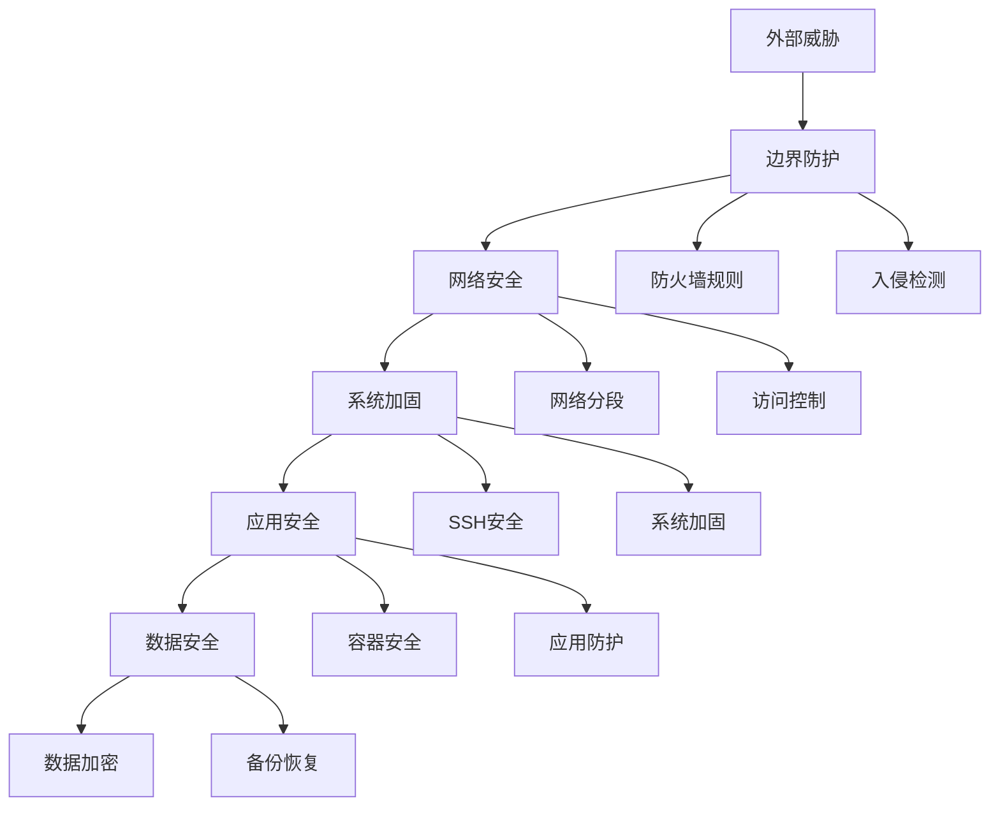

# 安全防护体系

现代企业级IT基础设施面临着日益复杂的安全威胁，构建多层次、全方位的安全防护体系已成为运维工作的重中之重。本章节将为你提供系统化的安全防护策略和实践指南，帮助你建立完整可靠的企业安全防护体系。

## 🛡️ 安全防护架构

我们的安全防护体系采用 **纵深防御** 策略，从多个维度构建安全防护：



## 📚 核心安全模块

### 🔐 [系统加固](./系统加固.md)
基础操作系统的安全配置和加固措施，是整个安全防护的基石。

**主要内容：**
- 操作系统安全基线配置
- 用户权限管理和访问控制
- 系统服务安全配置
- 内核参数优化
- 安全审计和日志配置

**关键指标：**
- 🎯 减少95%以上不必要的系统服务
- 🎯 实现细粒度的用户权限控制
- 🎯 建立完整的安全审计追踪

---

### 🔑 [SSH安全](./SSH安全.md)
远程访问的第一道防线，确保远程管理的安全性。

**主要内容：**
- SSH密钥认证配置
- 访问控制和限制策略
- SSH隧道和端口转发安全
- 多因素认证(MFA)配置
- SSH会话监控和审计

**安全要求：**
- ✅ 禁用密码登录，强制密钥认证
- ✅ 限制登录IP白名单
- ✅ 实施会话超时和并发限制

---

### 🔥 [防火墙](./防火墙.md)
网络边界防护的核心组件，控制网络流量的进出。

**主要内容：**
- iptables/netfilter规则配置
- UFW/firewalld管理
- 网络分段和隔离策略
- 入侵检测和防护(IDS/IPS)
- DDoS防护策略

**防护能力：**
- 🚫 阻断99%以上的恶意网络请求
- 🔍 实时监控网络异常行为
- ⚡ 毫秒级响应时间

---

### 🌐 [网络安全](./网络安全.md)
全面的网络层安全防护策略，保障网络通信安全。

**主要内容：**
- 网络架构安全设计
- VLAN分段和ACL控制
- VPN和加密通信
- DNS安全和防劫持
- 网络流量分析和监控

**安全目标：**
- 🔐 端到端加密通信
- 🎯 网络零信任架构实施
- 📊 全流量可视化监控

---

### 📦 [容器安全](./容器安全.md)
现代容器化环境的安全防护，适应云原生架构需求。

**主要内容：**
- Docker容器安全配置
- Kubernetes集群安全
- 镜像安全扫描和管理
- 容器运行时安全监控
- 微服务安全通信

**核心能力：**
- 🔒 容器镜像安全基线100%合规
- 🛡️ 运行时威胁实时检测
- 🚀 零停机安全更新

## 🎯 安全防护等级

根据业务重要性和风险等级，我们将安全防护分为三个等级：

| 等级 | 适用场景 | 防护措施 | 监控频率 |
|------|----------|----------|----------|
| **🔴 关键级** | 核心业务系统、数据库 | 全部安全措施 + 额外加固 | 实时监控 |
| **🟡 重要级** | 一般业务系统、应用服务 | 标准安全配置 | 5分钟检查 |
| **🟢 普通级** | 开发测试环境 | 基础安全措施 | 小时级监控 |

## 🔧 快速安全检查

使用以下命令快速评估系统安全状态：

```bash
#!/bin/bash
# 快速安全检查脚本

echo "=== 系统安全快速检查 ==="

# 检查SSH配置
echo "🔑 SSH安全检查..."
if grep -q "PasswordAuthentication no" /etc/ssh/sshd_config; then
    echo "✅ SSH密码登录已禁用"
else
    echo "❌ SSH密码登录未禁用"
fi

# 检查防火墙状态
echo "🔥 防火墙状态检查..."
if systemctl is-active --quiet ufw || systemctl is-active --quiet firewalld; then
    echo "✅ 防火墙已启用"
else
    echo "❌ 防火墙未启用"
fi

# 检查系统更新
echo "📦 系统更新检查..."
if [ -x "$(command -v apt)" ]; then
    UPDATES=$(apt list --upgradable 2>/dev/null | wc -l)
    echo "📊 可用更新: $((UPDATES-1)) 个"
elif [ -x "$(command -v yum)" ]; then
    UPDATES=$(yum check-update --quiet | wc -l)
    echo "📊 可用更新: $UPDATES 个"
fi

echo "=== 检查完成 ==="
```

## 📈 安全监控指标

### 关键安全KPI
- **入侵检测命中率**: > 99%
- **安全事件响应时间**: < 5分钟
- **系统漏洞修复时间**: < 24小时
- **安全合规达成率**: > 95%

### 实时监控面板
```bash
# 安全状态监控命令
watch -n 5 '
echo "🔍 实时安全监控 - $(date)"
echo "━━━━━━━━━━━━━━━━━━━━━━━━━━━━━━━━━━━━━━━━━━━━"
echo "🔐 SSH连接: $(who | wc -l) 个活跃会话"
echo "🔥 防火墙: $(iptables -L INPUT | grep -c DROP) 条拒绝规则"
echo "💻 CPU负载: $(uptime | awk -F"load average:" "{print $2}")"
echo "💾 内存使用: $(free | grep Mem | awk "{printf \"%.1f%%\", $3/$2 * 100.0}")"
echo "🌐 网络连接: $(netstat -an | grep ESTABLISHED | wc -l) 个活跃连接"
'
```

## 🚀 快速入门

1. **开始系统加固** → [系统加固指南](./系统加固.md)
2. **配置SSH安全** → [SSH安全配置](./SSH安全.md)  
3. **设置防火墙** → [防火墙配置指南](./防火墙.md)
4. **加强网络安全** → [网络安全策略](./网络安全.md)
5. **保护容器环境** → [容器安全实践](./容器安全.md)

## 📞 安全应急联系

!!! warning

    安全防护是一个持续的过程，需要定期评估、更新和优化。建议每月进行一次全面的安全检查和配置审核。
   


遇到安全事件时，请按以下优先级处理：

1. **🚨 紧急安全事件**: 立即隔离affected系统，通知安全团队
2. **⚠️ 安全漏洞发现**: 24小时内评估影响，制定修复计划  
3. **🔍 异常行为检测**: 48小时内完成调查分析

