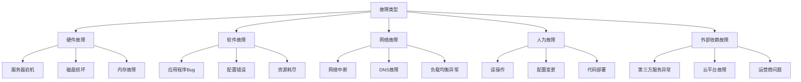
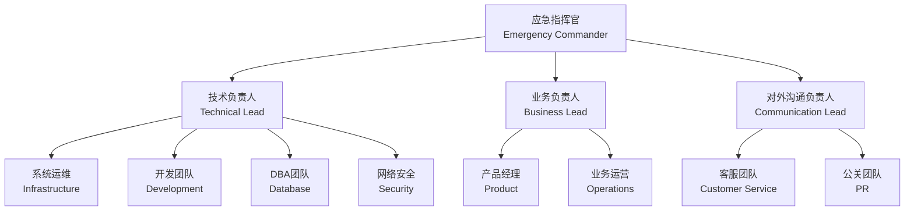
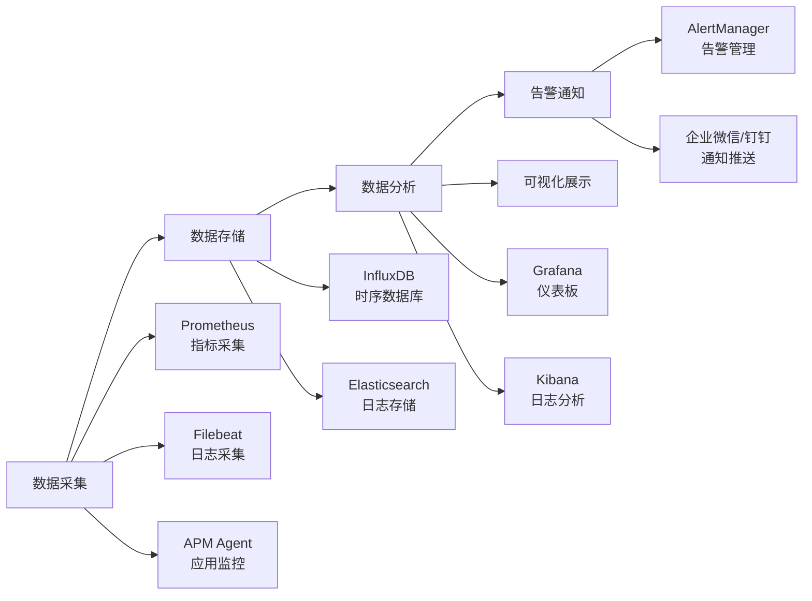
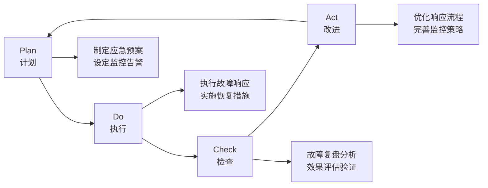

# 07-故障处理

本模块涵盖了系统故障处理的完整流程和最佳实践，帮助运维团队快速、有效地应对各类技术故障。

## 模块概述

系统运行过程中不可避免会遇到各种故障，及时、准确的故障处理是保障业务连续性的关键。本模块提供了从故障发现到完全恢复的标准化处理流程和实用工具。

### 核心内容

- **常见问题诊断与解决**：涵盖操作系统、中间件、应用层的常见故障及处理方法
- **应急响应流程**：标准化的故障分级、响应团队组织和处理流程
- **监控与预防**：故障预防措施和监控告警策略
- **复盘与改进**：故障后的分析总结和持续改进机制

## 文档结构

```
07-故障处理/
├── index.md          # 本概览文档
├── 常见问题.md       # 日常故障诊断和处理方法
└── 应急流程.md       # 应急响应流程和标准
```

## 故障处理原则

### 1. 快速响应
- **Golden Time**：故障发生后的前5分钟是关键时间窗口
- **分级响应**：根据故障影响范围和严重程度分级处理
- **并行处理**：故障恢复和根因分析可以并行进行

### 2. 标准化流程
- **统一标准**：使用标准化的故障分级和响应流程
- **角色明确**：清晰定义各角色职责和决策权限
- **文档记录**：完整记录故障处理过程和决策依据

### 3. 持续改进
- **事后复盘**：每次故障后都要进行深入分析和总结
- **预防为主**：通过监控、测试、演练等手段预防故障
- **经验沉淀**：将故障处理经验转化为标准操作程序

## 故障分类体系

### 按影响范围分类

| 级别 | 影响范围 | 响应时间 | 典型场景 |
|------|----------|----------|----------|
| P0 - 紧急 | 核心业务完全中断 | 5分钟内 | 主站宕机、数据库崩溃 |
| P1 - 高危 | 重要功能受影响 | 15分钟内 | 支付异常、登录故障 |
| P2 - 中等 | 部分功能受影响 | 30分钟内 | 单个服务异常、性能下降 |
| P3 - 低危 | 非核心功能异常 | 1小时内 | 统计延迟、页面异常 |

### 按故障源头分类



## 应急响应团队

### 组织架构



### 职责矩阵

| 角色 | 主要职责 | P0/P1级别 | P2/P3级别 |
|------|----------|-----------|-----------|
| 应急指挥官 | 整体决策协调 | 必须参与 | 按需参与 |
| 技术负责人 | 技术方案决策 | 必须参与 | 必须参与 |
| 业务负责人 | 业务影响评估 | 必须参与 | 按需参与 |
| 对外沟通负责人 | 内外部沟通 | 必须参与 | 按需参与 |

## 关键指标与SLA

### 响应时间指标

```yaml
响应时间SLA:
  P0级别:
    发现到响应: 5分钟
    响应到恢复: 2小时
    可用性目标: 99.99%
    
  P1级别:
    发现到响应: 15分钟
    响应到恢复: 4小时
    可用性目标: 99.95%
    
  P2级别:
    发现到响应: 30分钟
    响应到恢复: 8小时
    可用性目标: 99.9%
    
  P3级别:
    发现到响应: 1小时
    响应到恢复: 24小时
    可用性目标: 99.5%
```

### 监控覆盖率目标

- **基础设施监控**：100%覆盖所有生产服务器
- **应用性能监控**：100%覆盖核心业务应用
- **业务指标监控**：100%覆盖关键业务流程
- **用户体验监控**：覆盖主要用户使用场景

## 工具与资源

### 监控工具栈



### 常用工具清单

#### 诊断工具
```bash
# 系统监控
top, htop, atop          # 进程监控
free, vmstat, iostat     # 资源监控
netstat, ss, lsof        # 网络监控
dmesg, journalctl        # 系统日志

# 网络诊断
ping, traceroute, mtr    # 连通性测试
tcpdump, wireshark       # 包抓取分析
dig, nslookup           # DNS诊断
curl, telnet            # 服务测试
```

#### 应急脚本
```bash
# 快速诊断脚本
/opt/scripts/health_check.sh      # 系统健康检查
/opt/scripts/service_status.sh    # 服务状态检查
/opt/scripts/resource_monitor.sh  # 资源使用监控

# 应急处理脚本
/opt/scripts/service_restart.sh   # 服务重启
/opt/scripts/traffic_switch.sh    # 流量切换
/opt/scripts/emergency_scale.sh   # 紧急扩容
```

## 最佳实践

### 1. 故障预防
- **定期演练**：每季度进行应急响应演练
- **容量规划**：提前规划系统容量和扩容策略
- **监控完善**：建立全方位的监控体系
- **自动化**：尽可能自动化常见故障的处理流程

### 2. 故障处理
- **先止血再治病**：优先恢复服务，再分析根因
- **充分沟通**：及时向相关方通报故障状态和处理进展
- **详细记录**：完整记录故障现象、处理过程和最终结果
- **并行操作**：在确保安全的前提下，可以并行执行多个恢复操作

### 3. 故障复盘
- **无指责文化**：重点关注流程和技术问题，不追究个人责任
- **深入分析**：不仅要找到直接原因，更要挖掘根本原因
- **行动导向**：制定明确的改进措施和执行计划
- **经验分享**：将复盘结果分享给全团队，避免类似问题重复发生

## 持续改进机制

### PDCA循环



### 改进度量指标

- **MTTD (Mean Time To Detect)**：故障平均发现时间
- **MTTR (Mean Time To Repair)**：故障平均修复时间
- **MTBF (Mean Time Between Failures)**：平均故障间隔时间
- **可用性**：系统整体可用性百分比

## 快速导航

### 常见场景快速查找

| 故障现象 | 可能原因 | 快速定位 |
|----------|----------|----------|
| 服务无响应 | 进程死锁、资源耗尽 | [常见问题 - 应用层故障](./常见问题.md#应用层故障处理) |
| 响应速度慢 | 数据库慢查询、网络延迟 | [常见问题 - 性能问题](./常见问题.md#性能问题诊断) |
| 用户无法访问 | 网络中断、DNS故障 | [常见问题 - 网络故障](./常见问题.md#网络问题诊断) |
| 数据异常 | 数据库故障、同步问题 | [常见问题 - 数据库故障](./常见问题.md#数据库故障处理) |

### 紧急联系方式

```yaml
应急热线:
  技术支持: "400-xxx-1234"
  运维值班: "138-xxxx-5678"
  
内部群组:
  应急响应群: "企业微信-应急响应"
  技术支持群: "钉钉-技术支持"
  
外部联系:
  云平台支持: "400-xxx-yyyy"
  网络运营商: "10086"
```

