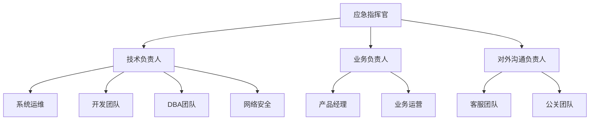

# 应急流程

本文档规范了系统故障、安全事件等应急情况的响应流程和处理标准，确保问题能够得到快速、有效的解决。

## 应急分级标准

### 故障等级定义

| 等级 | 影响范围 | 响应时间 | 处理时间 | 示例 |
|------|----------|----------|----------|------|
| P0 - 紧急 | 核心业务完全中断 | 5分钟内 | 2小时内 | 主站宕机、数据库崩溃、网络全中断 |
| P1 - 高危 | 重要功能受影响 | 15分钟内 | 4小时内 | 支付异常、用户无法登录、API大面积故障 |
| P2 - 中等 | 部分功能受影响 | 30分钟内 | 8小时内 | 单个服务异常、性能下降、部分用户受影响 |
| P3 - 低危 | 非核心功能异常 | 1小时内 | 24小时内 | 统计数据延迟、非关键页面异常 |

### 影响范围评估

```
业务影响 = 受影响用户数 × 功能重要性 × 持续时间

评估维度：
- 用户影响：全部用户 > 大部分用户 > 部分用户 > 个别用户
- 功能影响：核心功能 > 重要功能 > 一般功能 > 边缘功能
- 时间影响：持续时间越长，影响越严重
```

## 应急响应组织架构

### 应急响应团队



### 角色职责

**应急指挥官（Emergency Commander）**

- 决策整体应急响应策略
- 协调各团队资源
- 对外发布权威信息
- 决定是否启动灾难恢复计划

**技术负责人（Technical Lead）**

- 技术问题诊断和解决
- 技术团队协调
- 技术方案决策
- 系统恢复执行

**业务负责人（Business Lead）**

- 评估业务影响
- 制定业务应对策略
- 协调业务部门
- 用户影响评估

**对外沟通负责人（Communication Lead）**

- 内外部沟通协调
- 信息发布管理
- 客户关系维护
- 媒体应对

## 应急响应流程

### 第一阶段：故障发现与上报（0-5分钟）

#### 1.1 故障发现渠道
```bash
# 监控告警
- Zabbix/Prometheus告警
- 应用性能监控(APM)告警  
- 日志监控告警
- 第三方监控服务告警

# 用户反馈
- 客服热线报告
- 用户投诉反馈
- 社交媒体监控
- 业务方反馈

# 主动发现
- 定期健康检查
- 日常运维巡检
- 压力测试发现
- 安全扫描发现
```

#### 1.2 初步信息收集
```yaml
故障基本信息:
  发生时间: "YYYY-MM-DD HH:MM:SS"
  发现方式: "监控告警/用户反馈/主动发现"
  影响系统: "具体系统名称"
  故障现象: "简要描述"
  初步影响: "用户/业务影响评估"
  上报人员: "发现人姓名和联系方式"
```

#### 1.3 立即响应行动
```bash
# 立即执行
1. 记录故障发生时间
2. 截图保存现场证据
3. 通知应急响应团队
4. 启动应急响应群组
5. 开始故障处理记录
```

### 第二阶段：故障确认与分级（5-15分钟）

#### 2.1 故障确认检查清单
```bash
# 系统状态确认
□ 服务可用性检查
□ 数据库连接状态
□ 网络连通性测试
□ 负载均衡状态
□ 存储系统状态

# 监控数据确认
□ CPU/内存/磁盘使用率
□ 网络流量异常
□ 错误日志统计
□ 响应时间指标
□ 用户访问数据

# 业务影响确认
□ 受影响功能模块
□ 受影响用户群体
□ 数据完整性检查
□ 交易/订单影响
□ 第三方系统影响
```

#### 2.2 故障分级流程
```bash
#!/bin/bash
# 故障分级决策树

check_critical_systems() {
    if [ "$core_business_down" = "true" ]; then
        echo "P0 - 紧急"
        return 0
    fi
    
    if [ "$important_function_affected" = "true" ] && [ "$user_impact" = "high" ]; then
        echo "P1 - 高危"
        return 0
    fi
    
    if [ "$partial_function_affected" = "true" ]; then
        echo "P2 - 中等"
        return 0
    fi
    
    echo "P3 - 低危"
}
```

#### 2.3 应急团队激活
```yaml
P0级别:
  - 应急指挥官
  - 技术负责人
  - 业务负责人  
  - 对外沟通负责人
  - 全部技术团队

P1级别:
  - 技术负责人
  - 业务负责人
  - 相关技术团队
  - 客服团队

P2级别:
  - 技术负责人
  - 相关技术人员
  - 值班人员

P3级别:
  - 值班技术人员
  - 相关开发人员
```

### 第三阶段：快速恢复处理（15分钟-2小时）

#### 3.1 快速止损措施
```bash
# P0/P1级别快速处理措施
1. 流量切换
   - DNS切换到备用系统
   - 负载均衡权重调整
   - CDN回源切换

2. 服务降级
   - 关闭非核心功能
   - 启用缓存模式
   - 限制并发访问

3. 紧急重启
   - 重启故障服务
   - 重启相关中间件
   - 重启整个节点

4. 数据恢复
   - 数据库主从切换
   - 从备份恢复数据
   - 启用只读模式
```

#### 3.2 并行处理任务分工
```yaml
技术团队并行任务:
  运维组:
    - 系统状态检查
    - 基础设施恢复
    - 监控数据收集
    
  开发组:
    - 应用代码检查
    - 日志分析定位
    - 热修复准备
    
  DBA组:
    - 数据库状态检查
    - 数据一致性验证
    - 数据恢复操作
    
  网络组:
    - 网络连通性检查
    - 安全防护检查
    - 流量分析
```

#### 3.3 恢复操作记录模板
```bash
# 故障处理操作记录
echo "操作时间: $(date)" >> recovery.log
echo "操作人员: $USER" >> recovery.log
echo "执行命令: $COMMAND" >> recovery.log
echo "操作结果: $RESULT" >> recovery.log
echo "系统状态: $STATUS" >> recovery.log
echo "---" >> recovery.log
```

### 第四阶段：根因分析与彻底解决（并行进行）

#### 4.1 根因分析方法

**5W分析法**

- What: 发生了什么问题？
- When: 问题什么时候发生的？
- Where: 问题发生在哪里？
- Why: 为什么会发生这个问题？
- Who: 谁能解决这个问题？

**鱼骨图分析**
```
    硬件      软件      网络
      |        |        |
      |        |        |
   故障现象 ←-----------→
      |        |        |
      |        |        |
    人员      流程      环境
```

**时间线分析**
```bash
# 故障时间线重建
故障时间线:
  T-30min: 系统正常，用户访问正常
  T-15min: 监控显示响应时间轻微上升
  T-5min:  错误率开始上升
  T0:      大面积用户反馈无法访问
  T+5min:  确认故障，启动应急响应
  T+15min: 完成故障分级，开始恢复操作
```

#### 4.2 技术调查清单
```bash
# 系统层面
□ 服务器资源使用情况
□ 操作系统日志检查
□ 硬件故障检查
□ 网络设备状态

# 应用层面  
□ 应用程序日志
□ 配置变更记录
□ 代码部署记录
□ 第三方依赖状态

# 数据层面
□ 数据库性能指标
□ 数据一致性检查
□ 备份恢复测试
□ 存储系统状态

# 外部因素
□ 第三方服务状态
□ 网络运营商故障
□ DNS解析问题
□ CDN服务状态
```

### 第五阶段：验证与通报（恢复后30分钟内）

#### 5.1 系统恢复验证
```bash
#!/bin/bash
# 系统恢复验证脚本

verify_system_recovery() {
    echo "开始系统恢复验证: $(date)"
    
    # 服务可用性验证
    check_service_availability
    
    # 功能完整性验证
    check_functionality
    
    # 性能指标验证
    check_performance_metrics
    
    # 数据一致性验证
    check_data_consistency
    
    # 用户体验验证
    check_user_experience
    
    echo "系统恢复验证完成: $(date)"
}

check_service_availability() {
    services=("web" "api" "database" "cache")
    for service in "${services[@]}"; do
        if curl -f "http://localhost:8080/health/$service" > /dev/null 2>&1; then
            echo "✓ $service 服务正常"
        else
            echo "✗ $service 服务异常"
            return 1
        fi
    done
}
```

#### 5.2 恢复确认检查清单
```yaml
恢复验证清单:
  技术验证:
    - □ 所有服务状态正常
    - □ 监控指标恢复正常
    - □ 错误率降至正常水平
    - □ 响应时间符合SLA
    - □ 数据完整性确认
    
  业务验证:
    - □ 核心业务流程正常
    - □ 用户可以正常访问
    - □ 订单/交易正常处理
    - □ 第三方接口正常
    - □ 数据统计正常
    
  用户验证:
    - □ 用户反馈问题解决
    - □ 客服投诉量恢复正常
    - □ 社交媒体监控正常
    - □ 业务指标恢复正常
```

#### 5.3 故障通报模板

**内部通报**
```
【故障恢复通知】

故障编号: INC-2024-001
故障等级: P1
发生时间: 2024-01-15 14:30
恢复时间: 2024-01-15 16:45
持续时长: 2小时15分钟

影响范围: 用户登录功能异常，约影响1000名用户
故障原因: 数据库连接池配置错误导致连接泄露
解决方案: 调整连接池参数并重启应用服务

后续行动: 
1. 完善监控告警规则
2. 优化数据库连接管理
3. 安排专项故障复盘

技术负责人: 张三
业务负责人: 李四
```

**外部通报**
```
【服务恢复公告】

尊敬的用户：

我们监测到在1月15日14:30-16:45期间，部分用户在登录时可能遇到异常。
问题已于16:45完全解决，所有服务已恢复正常。

我们深表歉意，并已采取措施避免类似问题再次发生。
如有任何疑问，请联系客服热线400-xxx-xxxx。

感谢您的理解与支持！

XX公司技术团队
2024年1月15日
```

## 故障复盘与改进

### 复盘会议流程

#### 会议准备（故障恢复后24小时内）
```yaml
复盘会议准备:
  时间安排: 故障恢复后24-48小时内
  参会人员:
    - 应急响应团队全员
    - 相关业务负责人
    - 技术专家
    - 质量保证人员
  
  准备材料:
    - 故障处理时间线
    - 系统日志和监控数据
    - 操作记录和决策依据
    - 影响评估报告
    - 用户反馈汇总
```

#### 复盘会议议程
```
1. 故障情况回顾 (15分钟)
   - 故障时间线梳理
   - 影响范围确认
   - 处理过程回顾

2. 根因分析 (30分钟)
   - 技术原因分析
   - 流程问题分析
   - 人员操作分析

3. 响应过程评估 (15分钟)
   - 响应时效评估
   - 处理效率评估
   - 沟通协调评估

4. 改进措施讨论 (20分钟)
   - 技术改进建议
   - 流程优化建议
   - 预防措施建议

5. 行动计划制定 (10分钟)
   - 责任人确定
   - 完成时间节点
   - 验收标准确定
```

### 故障分析报告模板

```markdown
# 故障分析报告

## 故障基本信息
- 故障编号: INC-2024-001
- 故障等级: P1
- 发生时间: 2024-01-15 14:30:00
- 恢复时间: 2024-01-15 16:45:00
- 持续时长: 2小时15分钟
- 影响用户: 约1000名用户

## 故障描述
### 现象描述
用户无法正常登录系统，登录页面提示"服务器连接超时"

### 影响评估
- 业务影响: 用户无法登录，影响订单转化
- 用户影响: 1000名活跃用户受影响
- 财务影响: 预估损失10万元订单

## 故障原因分析
### 直接原因
数据库连接池耗尽，新的登录请求无法获取数据库连接

### 根本原因
1. 连接池最大连接数配置过小 (maxActive=10)
2. 连接泄露未及时发现和处理
3. 监控告警阈值设置不当

### 触发因素
午间用户访问高峰，并发登录请求激增

## 处理过程回顾
### 时间线
- 14:30 用户开始反馈登录异常
- 14:35 客服确认大面积用户反馈
- 14:40 技术团队开始排查
- 15:00 定位到数据库连接问题
- 15:15 临时扩容连接池参数
- 15:30 重启应用服务
- 15:45 服务初步恢复
- 16:45 完全恢复并验证

### 处理措施
1. 紧急调整数据库连接池参数
2. 重启应用服务释放异常连接
3. 增加监控和告警规则
4. 压力测试验证修复效果

## 改进措施
### 技术改进
1. 优化数据库连接池配置
   - 责任人: DBA团队
   - 完成时间: 2024-01-20
   - 验收标准: 通过压力测试验证

2. 完善连接泄露监控
   - 责任人: 运维团队
   - 完成时间: 2024-01-25
   - 验收标准: 监控告警正常触发

### 流程改进
1. 建立数据库连接监控SOP
2. 完善应急响应联系机制
3. 建立快速扩容应急预案

### 预防措施
1. 定期进行数据库连接压力测试
2. 建立连接池使用率监控告警
3. 完善代码审查中的资源管理检查

## 经验总结
### 做得好的方面
1. 问题响应及时，15分钟内完成定位
2. 团队协作高效，各角色职责明确
3. 临时措施有效，快速缓解了问题

### 需要改进的方面
1. 监控告警不够及时和准确
2. 数据库连接管理存在设计缺陷
3. 应急预案不够详细和可操作

### 经验教训
1. 资源监控必须覆盖所有关键组件
2. 应急预案需要定期演练和更新
3. 系统设计要考虑异常情况的处理
```

## 应急预案与演练

### 应急预案模板

```yaml
应急预案_数据库故障:
  触发条件:
    - 数据库连接失败超过30秒
    - 数据库响应时间超过5秒
    - 数据库CPU使用率超过90%
    
  应急措施:
    立即执行:
      - 启动数据库主从切换
      - 激活只读模式
      - 通知应急响应团队
      
    后续处理:
      - 检查主库故障原因
      - 评估数据一致性
      - 计划主库恢复
      
  回滚计划:
    - 确认从库数据完整性
    - 执行主从切回操作
    - 验证服务完全恢复
    
  验证检查:
    - 数据库连接正常
    - 数据读写正常
    - 应用功能正常
```

### 应急演练计划

```bash
#!/bin/bash
# 应急演练计划

# 季度演练安排
Q1_DRILL="数据库主从切换演练"
Q2_DRILL="网络中断应急演练"  
Q3_DRILL="服务器宕机演练"
Q4_DRILL="安全事件响应演练"

# 月度演练安排
MONTHLY_DRILL="监控告警响应演练"

# 演练执行流程
execute_drill() {
    local drill_type=$1
    
    echo "开始执行演练: $drill_type"
    echo "演练时间: $(date)"
    
    # 演练前准备
    prepare_drill_environment
    
    # 模拟故障场景
    simulate_failure_scenario
    
    # 执行应急响应
    execute_emergency_response
    
    # 记录演练结果
    record_drill_results
    
    # 恢复系统状态
    restore_system_state
    
    echo "演练完成: $(date)"
}
```

## 应急工具与资源

### 应急工具包

```bash
# 应急响应工具包目录结构
/opt/emergency-toolkit/
├── scripts/
│   ├── health_check.sh      # 系统健康检查
│   ├── service_restart.sh   # 服务重启脚本
│   ├── traffic_switch.sh    # 流量切换脚本
│   ├── db_backup.sh         # 数据库备份脚本
│   └── log_collector.sh     # 日志收集脚本
├── configs/
│   ├── emergency_contacts   # 应急联系方式
│   ├── service_endpoints    # 服务端点配置
│   └── runbook_templates    # 操作手册模板
├── playbooks/
│   ├── database_failure.md  # 数据库故障处理手册
│   ├── network_outage.md    # 网络中断处理手册
│   └── security_incident.md # 安全事件处理手册
└── tools/
    ├── monitoring_dashboard # 监控仪表板
    ├── log_analysis_tools   # 日志分析工具
    └── communication_tools  # 沟通协调工具
```

### 应急联系信息

```yaml
# 内部应急联系方式
emergency_contacts:
  command_center:
    name: "应急指挥中心"
    phone: "400-xxx-xxxx"
    email: "emergency@company.com"
    
  technical_team:
    - name: "技术负责人"
      phone: "138-xxxx-1234"
      email: "tech-lead@company.com"
      role: "技术决策"
      
    - name: "系统运维"
      phone: "139-xxxx-5678" 
      email: "ops@company.com"
      role: "系统运维"
      
    - name: "DBA"
      phone: "137-xxxx-9012"
      email: "dba@company.com"
      role: "数据库管理"

# 外部应急联系方式      
external_contacts:
  cloud_provider:
    name: "云服务商技术支持"
    phone: "400-xxx-yyyy"
    level: "企业级支持"
    
  network_provider:
    name: "网络运营商"
    phone: "10086"
    contact: "企业客户经理"
    
  security_vendor:
    name: "安全服务商"
    phone: "400-xxx-zzzz"
    service: "24小时应急响应"
```

### 沟通渠道与工具

```yaml
communication_channels:
  internal:
    - platform: "企业微信"
      group: "应急响应群"
      purpose: "内部协调沟通"
      
    - platform: "钉钉"
      group: "技术支持群"  
      purpose: "技术问题讨论"
      
    - platform: "Slack"
      channel: "#incident-response"
      purpose: "实时状态更新"
      
  external:
    - platform: "官方网站"
      purpose: "故障公告发布"
      
    - platform: "微博"
      account: "@公司官方"
      purpose: "公众沟通"
      
    - platform: "客服热线"
      number: "400-xxx-xxxx"
      purpose: "用户问题响应"

monitoring_tools:
  - name: "Zabbix"
    url: "http://monitor.company.com"
    purpose: "基础监控"
    
  - name: "Grafana"
    url: "http://grafana.company.com"
    purpose: "数据可视化"
    
  - name: "ELK"
    url: "http://elk.company.com"
    purpose: "日志分析"
    
  - name: "APM"
    url: "http://apm.company.com"
    purpose: "应用性能监控"
```

通过建立完善的应急响应流程，可以确保在故障发生时能够快速、有序、有效地进行处理，最大程度地减少业务损失和用户影响。定期的演练和复盘是保持应急响应能力的关键。